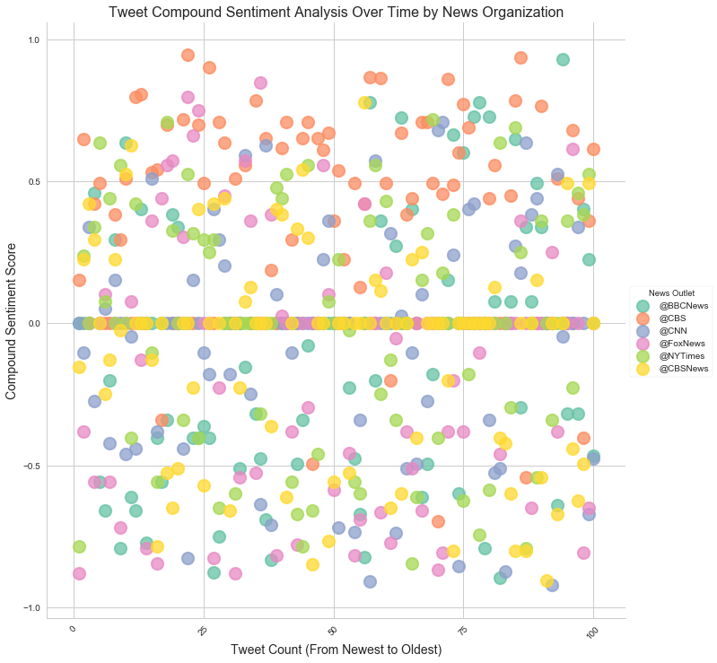

<h1>Unit 7 | Assignment - Distinguishing Sentiments</h1>

<h3>Background</h3>

Twitter has become a wildly sprawling jungle of information &mdash
140 characters at a time. Somewhere between 350 million and 500 million tweets are estimated to be sent out _per day_. With such an explosion of data, on Twitter and elsewhere, it becomes more important than ever to tame it in some way, to concisely capture the essence of the data.

Choose <b>one</b> of the following two assignments, in which you will do just that. Good luck!

<h3>News Mood</h3>

In this assignment, you'll create a Python script to perform a sentiment analysis of the Twitter activity of various news oulets, and to present your findings visually.

Your final output should provide a visualized summary of the sentiments expressed in Tweets sent out by the following news organizations: <b>BBC, CBS, CNN, Fox, and New York Times</b>.

The tools of the trade you will need for your task as a data analyst include the following: <b>tweepy, pandas, matplotlib, seaborn, textblob, and VADER.</b><br><br>


```python
# Import dependencies
import tweepy
import json
import numpy as np
import matplotlib.pyplot as plt
import pandas as pd
import seaborn as sns
from vaderSentiment.vaderSentiment import SentimentIntensityAnalyzer
analyzer = SentimentIntensityAnalyzer()
import time
from config import api_key, api_secret, a_token, a_token_secret
```


```python
# Setup Tweepy API Authentication
auth = tweepy.OAuthHandler(api_key, api_secret)
auth.set_access_token(a_token, a_token_secret)
api = tweepy.API(auth, parser=tweepy.parsers.JSONParser())
```


```python
#Get tweets from each news organization's twitter feeds.

# Create an empty list to hold sentiments.
sentiments = []


## I found that using CBSNews vs CBS drastically changed the output. 
## CBS tends to be more positive while CBSNews is more negative. 
## I left both pieces of code to show that either could be used, but opted to use both CBS and CBSNews to 
## illustrate the drastic difference in the two.

# news_outlet = ("@BBCNews", "@CBSNews", "@CNN", "@FoxNews", "@NYTimes")
news_outlet = ("@BBCNews", "@CBS", "@CNN", "@FoxNews", "@NYTimes", "@CBSNews")


# Loop though target users.
for user in news_outlet:
    
    # Counter 
    counter = 1

    # Loop through 5 pages of tweets for each news organization.
    # Get all tweets from the homefeed of each news organization.
    # Each page of tweets = 20, so by calling for a count of 100 
    # we accomplish the same thing with one less nested loop.

    public_tweets = api.user_timeline(user, count=100)

    #Loop through all tweets.
    for tweet in public_tweets:
    
        # Run the Vader analysis on each tweet.
        print("Tweet %s: %s" % (counter, tweet["text"]))

        # Establish the compound score, positive, negativem and neutral scores. 
        compound = analyzer.polarity_scores(tweet["text"])["compound"]
        pos = analyzer.polarity_scores(tweet["text"])["pos"]
        neu = analyzer.polarity_scores(tweet["text"])["neu"]
        neg = analyzer.polarity_scores(tweet["text"])["neg"]
        
        # define tweets ago and tweet_text
        tweets_ago = counter
        tweet_text = tweet["text"]

        # Append sentiments for each tweet to the empty sentiments list.
        sentiments.append({"News Outlet" : user,
                           "Date": tweet["created_at"],
                           "Compound" : compound,
                           "Positive" : pos,
                           "Negative" : neg,
                           "Neutral" : neu,
                           "Tweet Count" : counter,
                           "Tweet Text" : tweet_text})
        
        # Add to counter.
        counter = counter + 1
```

    Tweet 1: Corbyn 'irresponsible' for attending left wing Jewish event https://t.co/GVvt8Svs01
    Tweet 2: Tottenham shooting: Girl, 17, dies from gunshot wound https://t.co/yBqpNMY4iD
    Tweet 3: UK passports: Firm appeals move to make them in France https://t.co/TnuxN6YaeM
    Tweet 4: Bafta TV Awards: 'Must see moment' nominees revealed https://t.co/4Q0hodRzPy
    Tweet 5: UK ivory ban among 'toughest' in the world, says Gove https://t.co/zs3TZKrB1d
    Tweet 6: 'One-stop shops' set to speed up cancer diagnosis https://t.co/MFhvaEqcKf
    Tweet 7: Calor gas shortages leave customers without heating https://t.co/Hs2nF3uNbg
    Tweet 8: Momentum admits Labour 'failure' over anti-Semitism https://t.co/O5zEjqutYL
    Tweet 9: Met Police investigated over death of arrested man https://t.co/t7pRlNJ8sx
    Tweet 10: RT @BBC_HaveYourSay: Have you ever had to choose between the love of your life and your favourite sports team? #harryandmeghan's #RoyalWedd…
    Tweet 11: AI 'poses less risk to jobs than feared' says OECD https://t.co/7CS3sn6n1I
    Tweet 12: RT @BBCSteveR: Russia's Foreign Minister Sergei Lavrov tells me why current tension between Moscow &amp; the West "is worse now than in the old…
    Tweet 13: Snow, rain and floods make bank holiday travels a trial https://t.co/NV1ymrEg8s
    Tweet 14: Probe launched into Wrexham's HMP Berwyn prison death https://t.co/gkFDZehazt
    Tweet 15: Nazanin Zaghari-Ratcliffe's husband 'disappointed' with Boris Johnson https://t.co/tZvEhUbyFk
    Tweet 16: Swanage sea wall car crash pedestrian dies https://t.co/DWriuVxHbl
    Tweet 17: RT @BBCBreaking: South African anti-apartheid campaigner Winnie Mandela has died aged 81, her personal assistant says https://t.co/krdVvFLY…
    Tweet 18: Russian spy: Sergei Lavrov accuses West of 'children's games' https://t.co/MQX5K9gCd0
    Tweet 19: RT @BBCRosAtkins: Back in Jan 2017, my show Outside Source decided to try a self-monitoring system to increase our number of women contribu…
    Tweet 20: RT @BBCRosAtkins: This is a video the BBC’s made to show how a self-monitoring system we introduced on @BBCOS has increased the number of w…
    Tweet 21: Men in court over £1.3m Dromore drugs haul https://t.co/QbO24Ovddz
    Tweet 22: Alan Pardew: West Bromwich Albion part company with manager https://t.co/Tr0fshEmqo
    Tweet 23: 'More than half' of UK households face broadband problems https://t.co/muaUtmMWMO
    Tweet 24: Soldier dies in 'tragic diving incident' near Chepstow https://t.co/J2V3QgQt9z
    Tweet 25: RT @bbcweather: 4cm of #snow has already fallen in Bingley, W Yorkshire, 3cm in Leek, Staffordshire, 2cm in Aviemore, Highland and 1cm in N…
    Tweet 26: RT @BBCr4today: Doctors have warned that winter pressures on hospitals in England are likely to extend into the summer. Dr Chaand Nagpaul,…
    Tweet 27: Two dead and one arrested after 'wrong-way' M62 crash https://t.co/KqmsR1PiID
    Tweet 28: RT @BBCWiltshire: A Wiltshire soldier's died in a diving accident during an army training course - Lance Corporal George Partridge was with…
    Tweet 29: Director of public prosecutions Alison Saunders to stand down https://t.co/1NydzCaUGr
    Tweet 30: BBC wants gender balance of contributors by April 2019 https://t.co/aJAtycp02S
    Tweet 31: Mission to demonstrate space junk tech https://t.co/8EyoySAntr
    Tweet 32: Child poverty: Pale and hungry pupils 'fill pockets with school food' https://t.co/KKviJi7FuJ
    Tweet 33: Aggressive bailiff behaviour remains 'lingering concern' - MoJ review https://t.co/vxUXd5dOxU
    Tweet 34: UK winemakers toast record year https://t.co/M85g0Cc1mN
    Tweet 35: Silsden gas loss: Thousands face third day without supplies https://t.co/BR0ru9BvBh
    Tweet 36: Broken neck girl begins to walk again https://t.co/As2pxfUom6
    Tweet 37: London murder rate overtakes New York's https://t.co/JLyng8LWhO
    Tweet 38: RT @BBCSteveR: UK-Russia war of words over Salisbury:
    
    🇬🇧 about 🇷🇺
    reckless, despicable, culpable, malign, aggression, flagrant, barbaric,…
    Tweet 39: Eddie Izzard calls for Labour to 'stamp out' anti-Semitism https://t.co/vnZHIRCgKt
    Tweet 40: 😆😂🤣
    
    https://t.co/qjCDvEa0BI
    Tweet 41: Two unaccounted for after Knock house blaze https://t.co/T6zIznpzGZ
    Tweet 42: The Queen, Prince William and Catherine have attended an Easter service at Windsor Castle
    
    https://t.co/e9XSQsTtz0 https://t.co/9djlDBmqUP
    Tweet 43: RT @BBCSteveR: Why's Russian TV showing the inventor of the sandwich (the Earl of Sandwich) in a report on the Skripals? Anchor: blaming Ru…
    Tweet 44: Baby 'in cardiac arrest' at West Midland Safari Park https://t.co/RPgsXzxtEh
    Tweet 45: Did you get caught out on April Fools day?
    
    @RogerJ_01 and @BabitaBBC did on @BBCBreakfast thanks to a newspaper re… https://t.co/XPejEoUgsY
    Tweet 46: Queen attends Easter service at Windsor without Prince Philip https://t.co/CIc7tydUZz
    Tweet 47: Three WW2 aircraft - a Spitfire T9, Spitfire Mk IX and a Hawker Hurricane X - fly over wartime airfield Biggin Hill… https://t.co/BYe6r7JrYu
    Tweet 48: RT @BBCWorld: Inside the armoured green train used by Kim Jong-un on his trip to China https://t.co/C7djAnrGEC
    Tweet 49: RT @BBCScotlandNews: Bottle return scheme "should be UK-wide" https://t.co/JYZtsOAQd7 https://t.co/idYxOPNPxJ
    Tweet 50: RT @BBCWorld: See you later Alligator. 🐊 
    
    https://t.co/hHMns7Dpwo https://t.co/f9TkLjsMot
    Tweet 51: RT @bbcweather: Last night saw the second (and final) #BlueMoon of 2018 and our #WeatherWatchers managed to find some breaks in the cloud t…
    Tweet 52: RT @BBCSport: It was a controlled performance from Anthony Joshua last night.
    
    But Joseph Parker took him all the way.
    
    Read👉https://t.co/u…
    Tweet 53: RT @BBCScotlandNews: The forgotten Scot who was the RAF's founding father https://t.co/GiGYlx9Nx3 https://t.co/PjGjY2MOhU
    Tweet 54: Woman arrested after Edinburgh firearms incident https://t.co/Yby0jbo9QY
    Tweet 55: Northern Ireland boy killed in Tenerife hit and run https://t.co/dQlwuVFmfa
    Tweet 56: Man charged as Haringey murder victim named https://t.co/kkEvBzHilX
    Tweet 57: PM uses Easter message to praise "the triumph of the human spirit" as she recalls people affected by last year's te… https://t.co/bf5fS2q5ql
    Tweet 58: Northamptonshire suffering "massive increase" in gang activity https://t.co/IrfQZwJRrn
    Tweet 59: RT @BBC_HaveYourSay: Have you been invited to #harryandmeghan's #RoyalWedding on 19 May? 
    If you have, we'd like to hear from you. Email ha…
    Tweet 60: Child burial fees waived in England https://t.co/ttub5URCE2
    Tweet 61: PM reflects on Britain's 'dark moments' in Easter message https://t.co/OGCZM4XDGP
    Tweet 62: Increased fines for 'litter louts' come into effect https://t.co/rxLeoXf4tC
    Tweet 63: Labour Party 'not connected' to abusive anti-Jewish messages https://t.co/IfvZULgE9E
    Tweet 64: Royal wedding: Prince Harry and Meghan Markle choose flowers https://t.co/bEV8gIGXKN
    Tweet 65: Special needs cash shortfall 'leaves thousands of pupils unplaced' https://t.co/cdDPMiO6XY
    Tweet 66: Anthony Joshua beats Joseph Parker on points to add WBO world heavyweight title https://t.co/wK0SKDNiWQ
    Tweet 67: Spy poisoning: UK plays down Russia complaint at plane search https://t.co/HCb3NrprDP
    Tweet 68: Women found dead six hours after Basingstoke crash 'were amazing' https://t.co/z3VZRL4XnE
    Tweet 69: 8-year-old Alexa is going blind — she's created a list of things she wants to see before that happens ❤️ https://t.co/dr2Nrg3wkp
    Tweet 70: RT @ChrisMasonBBC: Christine Shawcroft will be replaced on Labour's National Executive Committee by Eddie Izzard
    Tweet 71: Shawcroft quits Labour ruling body https://t.co/P87CTEHuQT
    Tweet 72: RT @BBCSport: An inspirational young man. 👏
    
    Billy Monger, who had both his legs amputated after a crash last year, finished third on his B…
    Tweet 73: RT @BBCSteveR: After reading today's Russian papers, I have some good news &amp; some bad news. The good news: this isn't a new cold war. The b…
    Tweet 74: RT @BBCSport: FT: Brighton 0-2 Leicester
    
    It all happened late on at the Amex! Brighton miss a penalty, Leicester score two.
    
    https://t.co/…
    Tweet 75: RT @BBCSport: FT: West Brom 1-2 Burnley 
    
    It's eight successive defeats for West Brom.
    
    A great result for Burnley though, who tighten thei…
    Tweet 76: RT @BBCSport: FT: Watford 2-2 Bournemouth 
    
    Loads of drama in this one! 
    
    Four goals, including a stoppage time equaliser, plus one of the…
    Tweet 77: RT @BBCSport: FT: Manchester United 2-0 Swansea City 
    
    Two goals in the first-half gives #MUFC a comfortable home victory.
    
    https://t.co/tJ…
    Tweet 78: RT @BBCSport: FT: Newcastle United 1-0 Huddersfield Town 
    
    Ayoze Perez wins it for #NUFC! 
    
    #NEWHUD https://t.co/tJig6BnJWN https://t.co/xN…
    Tweet 79: UK soldier killed fighting IS in Syria named as Sgt Matt Tonroe https://t.co/FdCOYujDst
    Tweet 80: Redcar rescue: Four saved from sea by human chain https://t.co/ezQYF3dHZZ
    Tweet 81: RT @BBC_HaveYourSay: NHS at 70: We want your stories and memories of the #NHS from across the decades. Everyone from patients to doctors ar…
    Tweet 82: IS 'Beatles duo' complaints anger murdered David Haines's daughter https://t.co/fSB2vzlxuu
    Tweet 83: RT @BBCLondonNews: Man finds 'glistening' jewelled ring on London train https://t.co/g4uQpYVjZA https://t.co/MpiyoQ03t8
    Tweet 84: RT @BBCSport: Former British boxing champion Chris Edwards has died at the age of 41.
    https://t.co/1xhQwEeUDW https://t.co/WRC7zfykVO
    Tweet 85: RT @BBCWorld: There's a good reason why this woman was asked to play the flute during brain surgery 🧠 https://t.co/5SjPgUBZ77
    Tweet 86: University of Oxford 'sexist' alumni invite criticised https://t.co/nBHmGz6jEQ
    Tweet 87: Actor Eddie Redmayne, who played Stephen Hawking in The Theory of Everything, to give reading at physicist's funera… https://t.co/uSV397t5jM
    Tweet 88: Teachers raise prospect of national strike over pay https://t.co/awjrrajhlT
    Tweet 89: RT @BBCWorld: David Warner apologises for his part in the ball-tampering scandal and says he has a "tiny ray of hope" he might play for Aus…
    Tweet 90: RT @BBCPaulAdams: UK confirms Russian plane was searched at Heathrow yesterday. Security Minister Ben Wallace: "It is routine for Border Fo…
    Tweet 91: Russian spy: UK considers request to visit Yulia Skripal https://t.co/8KzXGEbfLj
    Tweet 92: What to expect from Saturday Night Takeaway as Dec hosts without Ant https://t.co/xkWPwyu7Ju
    Tweet 93: RT @BBCBreaking: Russia more than doubles number of UK diplomats expelled in spy poisoning row https://t.co/oGWaFQPLcW
    Tweet 94: RT @bbcthree: The amazing deaf dancer sharing his love and passion with others https://t.co/LdHnu8Fmct
    Tweet 95: RT @BBCSport: Ray Wilkins' family are in our thoughts today.
    
    He is in a critical condition in a London hospital.
    
    https://t.co/SxsiCdakSo…
    Tweet 96: RT @bbcweather: Here's the latest rain/snow picture. Helen https://t.co/KY6ahMOBCr
    Tweet 97: RT @BBCWorld: Hate food waste, love beer? 🍞🍻 https://t.co/PVeDQIkm03
    Tweet 98: Esther McVey: Saturday jobs help teenagers prepare for work https://t.co/ZdtW7SE0Ym
    Tweet 99: RT @BBCNewsNE: These lambs at @WhitehouseFarm have been knitted jumpers to keep warm 😍🐑 #HappyEaster https://t.co/Hf4dFf3wEi
    Tweet 100: RT @BBCSport: David Warner has said he is "resigned to the fact" he may never play for Australia again after his part in the ball-tampering…
    Tweet 1: No one does it quite like @eltonofficial. The artist himself will belt out some of his chart-topping hits on Elton… https://t.co/ckY4bUvTXI
    Tweet 2: The Las Vegas strip is about to light up brighter than ever before when Country Music’s Party Of The Year® takes ov… https://t.co/j1A2ZVHAoO
    Tweet 3: “If you don’t do something about it, then who are you? … It can happen to anyone.” - @aplusk 
    
    Tonight at 10/9c, a… https://t.co/EQabNc1UZI
    Tweet 4: Give it up for @KelseaBallerini! This star is one of the Female Vocalist Of The Year nominees and she's ready to ta… https://t.co/wLyHwkEGs2
    Tweet 5: Take and post a photo of the woman in your life who inspires you! The photo should only have one person against a n… https://t.co/BHdxXlWfKP
    Tweet 6: Expect epic performances by @kanebrown , @kelly_clarkson, @OfficialJackson, and more at this year's 53rd #ACMawards… https://t.co/3yso7Z0cjv
    Tweet 7: Will @HIGHVALLEY, @LancoMusic, @LOCASHmusic, @MidlandOfficial, or @runawayjune be named New Vocal Duo Or Group Of T… https://t.co/v0QIPLC47R
    Tweet 8: Count on Entertainer Of The Year nominee @LukeBryanOnline to crash the party with an epic performance at the 53rd… https://t.co/27ua60HTqu
    Tweet 9: Join @eltonofficial and some of today's hottest names in music when they take the stage to perform his most memorab… https://t.co/jz0jaShZIj
    Tweet 10: RT @ACMawards: The ACM for New Vocal Group of the Year goes to @MidlandOfficial! And yes, that really was @Reba on the phone! #ACMawards ht…
    Tweet 11: RT @ACMawards: In case you didn’t know, the ACM for New Male Vocalist of the Year goes to @BrettYoungMusic. Check out his reaction when @Re…
    Tweet 12: RT @ACMawards: Over the weekend @Reba called the ACM New Artist of the Year winners to let them know they had won! Let’s just say our New F…
    Tweet 13: Congratulations to the 53rd #ACMawards New Artist winners @Lauren_Alaina, @MidlandOfficial, and @BrettYoungMusic! W… https://t.co/Fr8H4arwGj
    Tweet 14: New start times in East/Central Time Zones #60Minutes 7:35ET/6:35CT #Instinct  8:35ET/7:35CT #NCISLA 9:35ET/8:35CT… https://t.co/8W5hAeLrvs
    Tweet 15: Don’t miss a minute of the action. Stream the Elite Eight® games LIVE today starting at 2PM ET with a FREE trial of… https://t.co/8NwU8HdiHR
    Tweet 16: RT @MomCBS: That's a wrap on the #Mom panel at #PaleyFest! Thanks for following along! https://t.co/we4JgqPt6P
    Tweet 17: RT @MomCBS: A fan just commented that #Mom helped bring him out of a deep depression. 💜💜💜 #PaleyFest
    Tweet 18: RT @MomCBS: "Go out for it anyway. If you're good for the role, you're good for the role." @theJaimePressly's advice for aspiring actors wi…
    Tweet 19: RT @MomCBS: Mom Co-Creator @GemmaRBaker just pointed out her own #Mom in the audience at #PaleyFest! 💜
    Tweet 20: RT @MomCBS: "I'm not someone in recovery who goes to AA, but I have taken so much away from it...to take one day at a time." - @theJaimePre…
    Tweet 21: RT @MomCBS: "You get to appreciate working with such talented people." - @AnnaKFaris #Mom #PaleyFest
    Tweet 22: RT @MomCBS: “I love this job. I love working with these women. I love working in front of the live audience… It’s alive and it’s fun.” - @A…
    Tweet 23: Get on your feet for @Jason_Aldean, @ThomasRhett, @ChrisStapleton, @KeithUrban, and @ChrisYoungMusic, the five nomi… https://t.co/oT5ogjdj4x
    Tweet 24: Get ready for some sweet games! Stream #5 Clemson vs #1 Kansas LIVE at 7PM ET and #11 Syracuse vs #2 Duke LIVE at 9… https://t.co/4WstgrKNnW
    Tweet 25: RT @SEALTeamCBS: In honor of #NationalPuppyDay... 😍 #SEALTeam https://t.co/4mIZPpiRlU
    Tweet 26: RT @HawaiiFive0CBS: Nothing like a man and his dog! 😍🐶 Happy #NationalPuppyDay to Eddie, the best pup on the Five-0 Task Force! #H50 https:…
    Tweet 27: Game on! 16 teams left and the race to the finish continues tonight. Stream #11 Loyola-Chicago vs #7 Nevada LIVE at… https://t.co/W374rmzzoC
    Tweet 28: Save the date! These are season finales you do NOT want to miss. RT if you're excited! https://t.co/UUQoWsPPSh https://t.co/cDl4WmxMtU
    Tweet 29: Congratulations to all of the @CBSDaytime nominees for the #DaytimeEmmys! See the full list of #DaytimeEmmy nominee… https://t.co/ivJVJWvfsf
    Tweet 30: Female Vocalist Of The Year nominee @MarenMorris will show her fans how it’s done when she takes the stage to showc… https://t.co/PITjmAoFT8
    Tweet 31: The legendary @Reba returns to host the 53rd #ACMawards and she’s proving just how comfortable she is behind the mi… https://t.co/XPXcSPRXqC
    Tweet 32: RT @nancyodell: Told my daughter I'd be presenting at @ACMawards again this year. (Woot woot!We both luv country music!)She took this pic o…
    Tweet 33: RT @ladyantebellum: Ecstatic to announce we'll be performing at the #ACMawards in Las Vegas again this year! https://t.co/Qfhs94j6FR
    Tweet 34: Country superstars @kennychesney, @ladyantebellum, @blakeshelton, and @KeithUrban have just been added to the stell… https://t.co/bJ4If7MacP
    Tweet 35: RT @YandR_CBS: Forever evolving, Forever inspiring, Forever Young and Restless. ❤️ Get ready to celebrate 45 years of #YR starting in just…
    Tweet 36: New start times in East/Central Time Zones: #60Minutes 7:37ET/6:37CT #Instinct series premiere 8:37ET/7:37CT… https://t.co/xT3YKqmu2M
    Tweet 37: Spend your Sunday streaming Second Round games LIVE with a FREE trial of CBS All Access! https://t.co/3P85rXLy4b https://t.co/zbWfirD9Ju
    Tweet 38: RT @instinctcbs: TONIGHT, Dr. Dylan Reinhart rewrites the book on abnormal behavior. Don't miss the premiere of #Instinct at 8/7c! https://…
    Tweet 39: If any duo knows how to rock the stage, it's @FLAGALine. The Vocal Duo Of The Year nominee will perform live at the… https://t.co/FknabB8NQp
    Tweet 40: How is your bracket looking after last night? Stream Second Round games LIVE today with a FREE trial of CBS All Acc… https://t.co/25JlIpgwog
    Tweet 41: Where better to spend #StPatricksDay than the place everybody knows your name? It’s just your luck that every singl… https://t.co/Fom5wmdENL
    Tweet 42: Stars @JakeMcDorman and Nik Dodani will join the cast in the upcoming revival of Murphy Brown coming to CBS.… https://t.co/JCAx29lo0i
    Tweet 43: RT @thegoodfight: Go behind the scenes with costume designer @DanLawsonStyle in "Behind The Style," a new weekly video series all about the…
    Tweet 44: The games have just begun! Continue to stream First Round games LIVE today with a FREE trial of CBS All Access:… https://t.co/YTGsJ48zYP
    Tweet 45: RT @TheTalkCBS: You asked, we answered! The fun never ends when the ladies #KeepTalking and answer your fan questions 🗣💬➡️ https://t.co/ie1…
    Tweet 46: RT @instinctcbs: Dr. Dylan Reinhart is lured back into the field from his life of quiet academia when a certain serial killer makes things…
    Tweet 47: Stream First Round games LIVE today starting at 12PM ET with a FREE trial of CBS All Access! https://t.co/3P85rXLy4b https://t.co/vZow3YD8cb
    Tweet 48: RT @CBSSports: It's the most wonderful time of the year. #MarchMadness https://t.co/e4c9qohqSR
    Tweet 49: Give these ladies some love! @Lauren_Alaina, @DBradbery, @carlypearce, and @RaeLynn are nominated for New Female Vo… https://t.co/IVhwURfJ3S
    Tweet 50: RT @ManWithAPlan: Hungry for more #ManWithAPlan bloopers and behind-the-scenes videos featuring cast like @matt_leblanc, @thelizasnyder, @k…
    Tweet 51: Music stars @MileyCyrus, @edsheeran, @ladygaga, and more will honor the legendary @eltonofficial and his hit songs… https://t.co/UzxARCCLnI
    Tweet 52: RT @thegoodfight: The verdict is in. The new season of #TheGoodFight is 🔥🔥🔥! Stream it now on CBS All Access: https://t.co/FkYSNSXlRb https…
    Tweet 53: RT @MadamSecretary: In less than an hour, #MadamSecretary's Keith Carradine will be taking over the @MadamSecretary Twitter page! Tweet alo…
    Tweet 54: RT @DierksBentley: Take and post a photo of the woman in your life who inspires you daily! Use the hashtag #WomanAmenACM in your post for a…
    Tweet 55: RT @MomCBS: If you missed guest star @KChenoweth in the latest episode of #Mom, not to worry! Watch now: https://t.co/RlvXoGOZ0l https://t.…
    Tweet 56: Give a round of applause to @KelseaBallerini, @MirandaLambert, @Reba, @MarenMorris, and @CarrieUnderwood, the five… https://t.co/Ncp1BTXx6N
    Tweet 57: RT @thegoodfight: Smart, sexy, and sophisticated. See what's coming this season on #TheGoodFight. https://t.co/CuKhx2G50P https://t.co/ygTI…
    Tweet 58: RT @BlueBloods_CBS: Even stand-up guys fall down sometimes. #BlueBloods is new tonight at 10/9c! https://t.co/UOlDm22wWW
    Tweet 59: Today and every day we celebrate the women in our lives who empower and inspire us. Share a story about an influent… https://t.co/9rVtqrElvT
    Tweet 60: Take and post a photo of the woman in your life who inspires you daily! Use the hashtag #WomanAmenACM in your post… https://t.co/7ShhvE48zy
    Tweet 61: RT @thegoodfight: Meticulously constructed. Soapy &amp; sexy. Intoxicating, savage television. 🔥 Here's what critics are saying about #TheGoodF…
    Tweet 62: This just in! @Jason_Aldean, @mirandalambert, @LukeBryanOnline, and many more are set to perform at the 53rd Academ… https://t.co/mfxw2VxzU4
    Tweet 63: Meet the ensemble of talented actors slated to join $1, a new mystery series coming to CBS All Access:… https://t.co/QoyYv7vxwg
    Tweet 64: Will @Jason_Aldean, @garthbrooks, @LukeBryanOnline, @ChrisStapleton, or @KeithUrban be named Entertainer Of The Yea… https://t.co/rMD8zjeX3s
    Tweet 65: RT @thegoodfight: It feels good to be back. 👠💄🔥 The season 2 premiere of #TheGoodFight is now streaming, exclusively on CBS All Access: htt…
    Tweet 66: RT @thegoodfight: Tomorrow, #TheGoodFight is back. Stream the season 2 premiere only on CBS All Access: https://t.co/tNFR8LBJO2 https://t.c…
    Tweet 67: Who are the trailblazing women in your life that inspire you? Join CBS and the ANA's #SeeHer initiative, celebratin… https://t.co/M0KqZ41Bes
    Tweet 68: Join @maria_bello, @aishatyler and @TeaLeoni in celebrating the accomplishments of women who have contributed to th… https://t.co/MefESBeFL3
    Tweet 69: In honor of Women's History Month, CBS and the Association of National Advertisers' (ANA) #SeeHer initiative will p… https://t.co/2wtYxKJVuO
    Tweet 70: RT @ZoeListerJones: Tonight’s an all new Life In Pieces and it’s directed by my ride or die @nataliaanderson!!!… https://t.co/2LPfmyLWrY
    Tweet 71: RT @MarenMorris: Hot damn! Woke up from my post-wisdom teeth haze to find out I’m up for 4 @ACMawards ! So honored, especially for the Dear…
    Tweet 72: RT @KelseaBallerini: Ohhhhh goodness. Incredible. Thank you thank you thank you. #female https://t.co/1ZTYjNfQeF
    Tweet 73: RT @KeithUrban: ACMs...... HOLY SMOKES!!!!! MAD LOVE TO U ALL THIS MORNING  FOR THESE INCREDIBLE NOMINATIONS. I’M EXTREMELY GRATEFUL!!!!!!!…
    Tweet 74: RT @ACMawards: Congratulations to this year’s #ACMawards Video of the Year nominees:
    “Black” - @DierksBentley
    “It Ain’t My Fault” - @Brothe…
    Tweet 75: RT @ACMawards: Please give a round of applause to this year’s #ACMawards Entertainer of the Year nominees: @Jason_Aldean, @GarthBrooks, @Lu…
    Tweet 76: .@ChrisStapleton, @ThomasRhett, @mirandalambert and more are all nominated for awards at Country Music's Party of t… https://t.co/Vm1vXRUDYJ
    Tweet 77: The Queen of Country, @Reba, is returning to host the 53rd #ACMawards on Sunday, April 15 at 8/7c. Here are a few o… https://t.co/Iqzz6Gql01
    Tweet 78: RT @survivorcbs: It’s time! #Survivor https://t.co/YPk6cGWrUA
    Tweet 79: RT @CBSThisMorning: TOMORROW: The nominees for the 2018 @ACMawards will be announced live by the one-and-only, @Reba! 
    
    Watch on @CBS in ou…
    Tweet 80: RT @thegoodfight: From the set design and costumes to hair and makeup, the production quality is truly next-level. Take a peek inside the u…
    Tweet 81: RT @LivinBiblically: The fun continues on Facebook! The #LivingBiblically cast is live to talk about tonight’s premiere. Tune in here: http…
    Tweet 82: RT @KevinCanWaitCBS: Can you get all the way through these #KevinCanWait bloopers without laughing?! @KevinJames,@LeahRemini and the rest o…
    Tweet 83: RT @ACMawards: That’s right! @Reba is headed to @CBSThisMorning on Thursday, March 1 to announce this year’s #ACMAwards' nominees. Tune in…
    Tweet 84: RT @ScorpionCBS: You can't hack your way to a 197 IQ, but you are well on your way with these Genius Facts from #TeamScorpion! 💻 You can be…
    Tweet 85: RT @SuperiorDonuts: You can always count on @DavidKoechner for a laugh! Did your favorite Tush moment make the list? Catch a new #SuperiorD…
    Tweet 86: RT @TheTalkCBS: TODAY: We loved them together then &amp; we love seeing them together now! Welcome back to the show @THESaraGilbert​'s good fri…
    Tweet 87: RT @thegoodfight: As foundations begin to crumble, our characters struggle to make sense of this new dystopian world. The cast teases what'…
    Tweet 88: #LivingBiblically's @linzkraft and @jrfergjr appeared on @KCBS's Facebook Live this morning, talking all about what… https://t.co/4RebcHuuMQ
    Tweet 89: RT @CBSSports: Introducing CBS Sports HQ, a New 24/7 Direct-to-Consumer Streaming Network for Sports News, Highlights, &amp; Analysis.
    
    Stream…
    Tweet 90: RT @CBSBigBrother: It’s down to the final 5 celebrity Houseguests, and anyone could take home the grand prize! Tune in NOW to watch the #BB…
    Tweet 91: RT @startrekcbs: Binge the entire first season of #StarTrekDiscovery. All episodes now streaming exclusively on CBS All Access: https://t.c…
    Tweet 92: RT @thegoodfight: #TheGoodFight returns in 1 week. Season 2 premieres Sunday, March 4. https://t.co/nomCao1GWp https://t.co/BOn6bOe9Tb
    Tweet 93: RT @thegoodfight: This is our new favorite thing. Christine Baranski debuted #TheGoodFight the Musical on @colbertlateshow last night! 🎵🎤…
    Tweet 94: RT @LivinBiblically: Confession time: have YOU ever hit the "close door" button in an elevator while somebody was approaching? The cast of…
    Tweet 95: RT @CBSEyeSpeak: Mark your calendars! #CBSEyeSpeak kicks off March 14 with The EYE Speak Summit. Follow our page for more details! https://…
    Tweet 96: RT @CBSEyeSpeak: Proud to announce a new CBS initiative, promoting female empowerment and developing the next generation of leaders through…
    Tweet 97: RT @LivinBiblically: When you're living by the Bible, it's good to have a priest and a rabbi on call (provided they answer their phones, th…
    Tweet 98: RT @thegoodfight: Chicago lawyers are being hunted and the world is going insane. 
    
    The new season of #TheGoodFight premieres Sunday, March…
    Tweet 99: Ready for some larger than life competition? This new series from @MarkBurnettTV will premiere in summer 2018.… https://t.co/gDXHLdIJ5v
    Tweet 100: With tournament dreams on the line, make sure to stream these college basketball matchups on CBS All Access:… https://t.co/SGkYUZrQWB
    Tweet 1: A dingy, old painting found in an Iowa art gallery's closet turns out to be the work of a 16th-century Dutch master… https://t.co/lwmWxdjL7N
    Tweet 2: A coal power company files for bankruptcy and asks President Trump for a bailout https://t.co/ju4AXFbI7b https://t.co/7ylHVUfAz8
    Tweet 3: Survivors of a school shooting in Parkland, Florida, returned from spring break to new security measures -- includi… https://t.co/LI2iLBqxzy
    Tweet 4: RT @AC360: They "look like the bar scene in Star Wars" Former Obama White House Chief of Staff Leon Panetta on President Trump's choice of…
    Tweet 5: The White House is "looking into" embattled EPA Administrator Scott Pruitt's housing situation amid reports that he… https://t.co/iyae5nvbbu
    Tweet 6: Winnie Madikizela-Mandela reveals South Africa's uncomfortable truths | By Kevin Bloom via @CNNOpinion… https://t.co/IaJjfOLJK7
    Tweet 7: A Cleveland fertility clinic is facing dozens of legal actions after failure of a cryopreservation tank containing… https://t.co/npfuQvCeQC
    Tweet 8: Dating app Grindr says it will stop sharing the HIV status of its users with other companies https://t.co/J4Ncf5G0Kx https://t.co/ezWSXB46wZ
    Tweet 9: John Oliver compares Sinclair news anchors to “members of a brainwashed cult” https://t.co/5Nu0JMbYtT https://t.co/0kNPCmZEDe
    Tweet 10: President Trump's tweets this weekend attacked:
    
    ■ The news media, except for Fox News and Sinclair Broadcast Group… https://t.co/qnOwchRCI0
    Tweet 11: President Trump's latest dog whistle on immigration is more like a scream | Analysis by @CillizzaCNN… https://t.co/5d5mzDA7dT
    Tweet 12: Sinclair tells stations to air media-bashing promos — and the criticism goes viral https://t.co/dyZP1g6g4z https://t.co/2ev2q7heAB
    Tweet 13: A family's SUV found at the bottom of a California cliff last week may have been deliberately driven off the road,… https://t.co/2OTBqYvRyF
    Tweet 14: Winnie Madikizela-Mandela, the South African anti-apartheid campaigner and former wife of the late President Nelson… https://t.co/XwFyzlLOeP
    Tweet 15: Keeping Them Honest: What triggered President Trump's weekend Twitter tirade? Was it the company he was keeping at… https://t.co/ity17j0xw3
    Tweet 16: 56 cases of severe bleeding in Illinois, including two deaths, have been tied to synthetic cannabinoids -- often ca… https://t.co/m2o15n47Lj
    Tweet 17: The Trump administration has announced several changes for Medicare plans aimed at increasing competition and reduc… https://t.co/LLYcOf1E1l
    Tweet 18: RT @betsy_klein: 🙋🐰 hop on over to the @CNN Instagram story for more from me on #EggRoll2018 https://t.co/FKciIlEIlP
    Tweet 19: The bunny who stole the show at the 140th White House Easter Egg Roll https://t.co/5ro9OVOeaG https://t.co/TJ1xfDW2YS
    Tweet 20: The DOJ has announced it will evaluate immigration judges on how many cases they close and how fast they hear cases… https://t.co/9QXJVouvlM
    Tweet 21: CNN's @ErinBurnett: "The President talks the tough talk on firing. But when it comes down to it, he isn't saying th… https://t.co/yRkBi4aPUh
    Tweet 22: RT @OutFrontCNN: "It's not a dog whistle. It's a foghorn. ... It's simply racist to say that people are stealing our country." - Democratic…
    Tweet 23: 4 groups that are warming up to Donald Trump | Analysis by @CillizzaCNN https://t.co/XlCSBzqcHD https://t.co/bNatECK1LM
    Tweet 24: "Is this America's new face to the world?" asks Ruth Ben-Ghiat, writing via @CNNOpinion about this photo of White H… https://t.co/emYfkdkufe
    Tweet 25: A Florida middle school teacher is resigning after it was found she was also the host of a white supremacist podcas… https://t.co/AjDkPaplrX
    Tweet 26: Trump is obsessed with going 'nuclear' in the Senate | Analysis by CNN's Z. Byron Wolf https://t.co/ILKDLi4fWQ https://t.co/zP0OaZKdvk
    Tweet 27: Roger Stone's potential ties to WikiLeaks and its founder, Julian Assange, are being investigated by special counse… https://t.co/wRd2OcAxi1
    Tweet 28: Intel shares dipped several percentage points on a report that Apple plans to start making its own processors for M… https://t.co/6jtXt1rfpS
    Tweet 29: President Trump has nominated Justin Muzinich as the Treasury Department's deputy secretary. He will serve as Treas… https://t.co/P5ptl6e76M
    Tweet 30: California's attorney general sued Sutter Health, accusing the hospital giant of illegally quashing competition and… https://t.co/OX5B6cII9E
    Tweet 31: RT @CNNSitRoom: If President Trump pulls the US out of Syria, he will “pay a price ... from a history’s point of view,” former CIA Director…
    Tweet 32: The Environment Protection Agency wants to give automakers a break on emissions rules established under the Obama A… https://t.co/pHrCejgpAI
    Tweet 33: Wall Street is sending President Trump a message: Don't start a trade war. And lay off Amazon, one of the most impo… https://t.co/d53hoXQ0KQ
    Tweet 34: RT @CNNSitRoom: After President Trump called the DOJ and FBI an embarrassment to our country, Rep. Castro says he’s surprised that Jeff Ses…
    Tweet 35: How office buildings are reducing their carbon footprint https://t.co/wpTo0rT1Re https://t.co/f5BnMN5Sov
    Tweet 36: The National Institute on Alcohol Abuse and Alcoholism is coming under scrutiny over communications with the alcoho… https://t.co/7iQzWF9C64
    Tweet 37: The Trump administration is reconsidering its proposal to sharply increase entry fees at some popular national park… https://t.co/5unIjFba2q
    Tweet 38: RT @TheLeadCNN: Sinclair responds to criticism of their media-bashing promos that TV anchors were forced to read https://t.co/f3NrQGtVBK ht…
    Tweet 39: One day after Vermont lawmakers approved sweeping gun control measures that include limits on the size of magazines… https://t.co/d0ala3G2qY
    Tweet 40: Democratic Rep. Elizabeth Esty announces she is not seeking re-election after revelations that she kept her chief o… https://t.co/IyJfBqMiuC
    Tweet 41: RT @TheLeadCNN: Dem. Senator Mazie Hirono calls President Trump's suggestion to pull US troops out of Syria another example of his "incoher…
    Tweet 42: The White House says a new immigration push is coming as President Trump posts a string of tweets pushing a hard li… https://t.co/OK9Gv0UIgL
    Tweet 43: Democratic Rep. Elizabeth Esty announces she is not seeking re-election after revelations that she kept her chief o… https://t.co/1Q9XuyMgg7
    Tweet 44: CNN has learned that the US military is discussing sending more troops to Syria; US President Trump remarked last T… https://t.co/MsQvMGNVkj
    Tweet 45: Elizabeth Esty just bowed to the inevitable | Analysis by @CillizzaCNN https://t.co/5X8xQd1n9A https://t.co/Q5GbV1PgS9
    Tweet 46: A Democratic candidate in Kentucky said she will pull her campaign ads from a local Sinclair station, and called on… https://t.co/OKuTLtQHkK
    Tweet 47: RT @TheLeadCNN: CNN has learned that the US military is discussing sending more troops to Syria, as Trump said last Thursday that the US wo…
    Tweet 48: The conservative majority is undermining worker protections from the 1930s, Justice Ruth Bader Ginsburg wrote, "wit… https://t.co/iHkbwYngxo
    Tweet 49: RT @CNNnewsroom: Sinclair Broadcasting’s “fake news" promo sounds "a lot like pro-Trump anti-media messaging” says CNN’s @brianstelter http…
    Tweet 50: If Trump really wanted a DACA deal, there'd be a DACA deal | Analysis by CNN's Gregory Krieg https://t.co/IPTcxApUSu https://t.co/hP4h2kjGKC
    Tweet 51: New York tightens gun restrictions for domestic abusers https://t.co/RHjSk55MQn https://t.co/e9RUJJJX70
    Tweet 52: A dingy, old painting found in an Iowa art gallery's closet turns out to be the work of a 16th-century Dutch master… https://t.co/OpnL196Rkr
    Tweet 53: President Trump puts hold on more than $200 million in Syria recovery funds https://t.co/UV71l7zsDf https://t.co/UIGBGCK6rK
    Tweet 54: BREAKING: The Dow drops 459 points as trade tensions rise. Amazon loses 5% after Trump's Twitter attacks on the int… https://t.co/WwKMdPAiiu
    Tweet 55: Amelia Gray Hamlin, the daughter of actors Lisa Rinna and Harry Hamlin, revealed on Instagram that she struggled wi… https://t.co/YlfOQR3mkX
    Tweet 56: Pope Francis used his Easter Sunday address to call for "reconciliation for the Holy Land," in an apparent referenc… https://t.co/kxDMzalVhT
    Tweet 57: RT @CNNMoney: Dow closes down 459 points on trade war fears, tech drop. Nasdaq sinks 2.7%. Amazon loses 5% after Trump attack. https://t.co…
    Tweet 58: Pernilla Lindberg wins her first title at her 250th professional tournament -- and it's a major… https://t.co/pShnuskrXn
    Tweet 59: RT @CNNnewsroom: Our textbooks are so outdated they "talk about going to your local librarian so they can talk to you about this new thing…
    Tweet 60: A lawyer for President Trump has begun the process of appealing last month's decision by a New York judge to allow… https://t.co/5N5V3yaEw6
    Tweet 61: An official with the US Immigration and Customs Enforcement office in San Francisco apologized for posting an image… https://t.co/NNBmMXOTrL
    Tweet 62: Losing MLK "hurts all the time," but we fight on, Jesse Jackson says https://t.co/NUfuH4Chuc via @CNNOpinion https://t.co/QGS3mQzJal
    Tweet 63: Why Sinclair matters: The company is the largest owner of local TV stations in the US, and local news is Americans'… https://t.co/FtwlHH0iZH
    Tweet 64: Sinclair's fake-news zombies should terrify you | By David Rothkopf via @CNNOpinion https://t.co/rmEhwdbIdR https://t.co/G9vZz0YIQw
    Tweet 65: A coal power company files for bankruptcy and asks President Trump for a bailout https://t.co/BHqry0OJUr https://t.co/qIhW9NhYgV
    Tweet 66: Critics are calling Sinclair's promos pro-Trump propaganda. Now the company is defending the initiative as a "corpo… https://t.co/xPRM8RxI31
    Tweet 67: Inspired by the West Virginia strike in which teachers demanded and got a pay raise from state leaders, a wave of e… https://t.co/NiKcjUGle7
    Tweet 68: Pope Francis baptized a Nigerian migrant -- who shot to fame after confronting a thief on the streets of Rome -- as… https://t.co/RBaHosr7jD
    Tweet 69: Winnie Mandela, the South African anti-apartheid activist and former wife of the late President Nelson Mandela, has… https://t.co/Ij5SXPaYsJ
    Tweet 70: This 17-year-old applied to 20 of the best universities in the US and was admitted to every single one with a full… https://t.co/kp5FbvapRr
    Tweet 71: Special counsel Robert Mueller's office is defending an agreement it made with a Dutch lawyer tied to former Trump… https://t.co/BW9R1sfmFC
    Tweet 72: These teens are marching 50 miles to Memphis -- one mile for each year since Martin Luther King Jr. was killed… https://t.co/sBWhnAmyYf
    Tweet 73: RT @CNNnewsroom: Democratic Rep. John Delaney slams Trump's attacks on Amazon as "very dangerous... It's clearly an attack on the free and…
    Tweet 74: More than three dozen people suffered severe bleeding, and one died, related to synthetic cannabinoids, according t… https://t.co/xAgbYDh6Dh
    Tweet 75: Here's why Oklahoma teachers walked out today | Analysis by @CillizzaCNN https://t.co/6ntqk05KnJ https://t.co/3eoBIjAPaQ
    Tweet 76: Marijuana legalization could help offset the opioid epidemic, studies find https://t.co/qulyDRslrm https://t.co/h8IzanZE3D
    Tweet 77: China hits the United States with tariffs on $3 billion of exports https://t.co/nNT3krXSkn https://t.co/ioqEwtkFiQ
    Tweet 78: White House confirms President Trump and Russian President Vladimir Putin discussed the possibility of meeting at t… https://t.co/EgQnltqxbh
    Tweet 79: A family's SUV found at the bottom of a California cliff last week may have been deliberately driven off the road,… https://t.co/cCZRaFKWvj
    Tweet 80: Democratic Rep. John Garamendi on President Trump's comments that Democrats are to blame for not having a deal on D… https://t.co/ZCA2WWv3Sc
    Tweet 81: President Trump's attacks on Amazon are working. The company's stock sank 5% Monday after the President accused it… https://t.co/ExjxHHfLoF
    Tweet 82: This ancient Chinese art was at risk of becoming obsolete. Here's how Dragon scale bookbinding is being resurrected… https://t.co/2sq6WpMqbA
    Tweet 83: President Trump says "our country is being stolen" due to an influx of illegal immigration, blaming Democrats for w… https://t.co/6BEn0qGJaA
    Tweet 84: John Oliver compares Sinclair news anchors to “members of a brainwashed cult” https://t.co/X8xGi5jwad https://t.co/aRhiapjGCh
    Tweet 85: RT @CNNnewsroom: "Instead of finding logical sources for funding, they just want to cut and take away... Our kids deserve better" says a Ke…
    Tweet 86: Rescuers in Southern California spotted and freed a 13-year-old boy who was stuck in a maze of drainage pipes for a… https://t.co/BWqLvxe86t
    Tweet 87: The best travel photos of 2018 (so far) https://t.co/lhcuCYTYnn https://t.co/Qc11bBFpcg
    Tweet 88: RT @CNNMoney: McDonald's is tripling its tuition benefits because of the new tax law https://t.co/12QVVaIKVR https://t.co/7ljjVYO8qw
    Tweet 89: Apple is proposing 13 new emojis in an effort to better represent people with disabilities https://t.co/0LtHvSiV3b https://t.co/FlN4JhxTr5
    Tweet 90: RT @CNNnewsroom: "We would much rather be in our classrooms teaching today. I would much rather be with my students but... I need to be her…
    Tweet 91: Teachers in Oklahoma are walking out of school in protest, demanding better salaries and funding from lawmakers.
    
    W… https://t.co/NAhcoZjFw8
    Tweet 92: A gun attack by the terror group Boko Haram in northeastern Nigeria on Sunday night left 18 people dead and wounded… https://t.co/Ty0jaG4CiN
    Tweet 93: Who stands to gain if President Trump pulls the US out of Syria? https://t.co/9eoSqIuDZ3 https://t.co/1DCTPj1pT9
    Tweet 94: President Trump's latest dog whistle on immigration is more like a scream | Analysis by @CillizzaCNN… https://t.co/KG4262xGSB
    Tweet 95: Teachers in Kentucky are walking off the job today and holding rallies at the state Capitol over pension changes… https://t.co/t4812bM1cU
    Tweet 96: JUST IN: White House confirms President Trump and Russian President Vladimir Putin discussed the possibility of mee… https://t.co/B3bJx9FNol
    Tweet 97: She was too short to play Goofy. Then she invented Spanx. Now she's a billionaire. https://t.co/8UBc6YV2IU https://t.co/Bh70SauZNt
    Tweet 98: President Trump and first lady Melania Trump are hosting the 140th annual White House Easter Egg Roll… https://t.co/5T3U6IUatM
    Tweet 99: Shulkin says he was fired. The White House said he resigned. Here's why it matters. https://t.co/GQctLkajaB https://t.co/3bOKk1Yc5t
    Tweet 100: Oklahoma teachers are rallying and walking out of classes, expressing frustration over funding and salaries.
    
    Follo… https://t.co/thLk0QCQQ1
    Tweet 1: .@kimguilfoyle: “@POTUS didn’t kill DACA…I think the Democrats killed it, and people who were too entrenched in the… https://t.co/mx8ej8vv4P
    Tweet 2: Pregnant woman upset with Disney Cruise Line after family escorted out by armed officer https://t.co/KpN8sAJxhW
    Tweet 3: .@SebGorka: “If we don’t have borders, the word ‘America’ ceases to have meaning.” #Hannity https://t.co/bqYRYJBjee
    Tweet 4: .@MarkSKrikorian: “If you’re an illegal immigrant, and walk up to our immigration inspector at a border, and say ‘H… https://t.co/Bay4PZjna0
    Tweet 5: Mom deployed Taser on son to wake him up for church, court docs say https://t.co/77cv8CmPEQ
    Tweet 6: Charles Barkley Blasts #Trump Supporters: They Won't Say 'My Life Sucks Because of Me' https://t.co/StltuqmgZF
    Tweet 7: Jill McCabe, wife of fired @FBI official Andrew McCabe, breaks silence on campaign money https://t.co/6ElU8SQqDt
    Tweet 8: Paul Pitino: "I don't think any human being deserves a statue...When you put up a [statue of a] human, you're alway… https://t.co/2ujRBodtQ9
    Tweet 9: 'You Blame #Trump But Not Dems?': @marthamaccallum Debates Illegal Immigrant Who Worked on Wall Street   #TheStory https://t.co/7hBWpdQMDI
    Tweet 10: .@JessicaV_CIS on migrant caravans heading to U.S.: "We don't need to just sit back and stand by while people take… https://t.co/gVZ9oVXPRf
    Tweet 11: .@JessicaV_CIS on migrant caravans heading to U.S.: "It's a challenge to our sovereignty and the president needs to… https://t.co/uOqJtq72lR
    Tweet 12: While at the @WhiteHouse annual Easter egg roll Monday, @EricTrump joined @foxandfriends to talk about the state of… https://t.co/QyZtg2Wai7
    Tweet 13: .@panerabread data breach exposes customer records (via @FoxBusiness) https://t.co/L1sG8gnsZz
    Tweet 14: Hiker, 25, plunges to his death from dangerous Hawaii trail https://t.co/jnOC9xvQwO
    Tweet 15: The Marines ease tattoo rules, the strictest in the military https://t.co/9DctYdv5ZY
    Tweet 16: Mary Ann Mendoza, whose son was killed by an illegal immigrant: “Our politicians don’t have to negotiate or offer a… https://t.co/wnOY9R5s35
    Tweet 17: Stoneman Douglas students return to class mandatory carrying clear backpacks https://t.co/arcZRqMaEb
    Tweet 18: Kathy Griffin wants audiences to laugh off her infamous Trump photo https://t.co/8tKPI1wDsz
    Tweet 19: .@RobGronkowski fulfills heart transplant patient's 'one wish' https://t.co/QqA7uVAXEy
    Tweet 20: Amb. Geronimo Gutierrez: "[NAFTA] needs updating and modernizing and that's why we're focusing, with the U.S. and o… https://t.co/jQqfHqzF1L
    Tweet 21: EXCLUSIVE: @usairforce veteran sues after being pulled from ceremony mid-speech https://t.co/qU6Q1abWJ9
    Tweet 22: "It is in our own interest to have a secure border in our southern border and we're also in favor of having a secur… https://t.co/thC7Hy2H8W
    Tweet 23: "We certainly understand the concern not only that President #Trump has, but people in the United States here have,… https://t.co/SPRGz2QPT8
    Tweet 24: "Mexico's migration policy is to seek that any migration is legal, safe, orderly, and respectful of basic human rig… https://t.co/sClLUdlb2R
    Tweet 25: .@Schwarzenegger made his first public statement after undergoing heart surgery on Thursday.… https://t.co/odToWzLrBl
    Tweet 26: #Trump suggested @WhiteHouse as potential venue for possible Putin meeting, White House says https://t.co/YYwbgwx7Ue
    Tweet 27: Mother of 3 whose cancer was dismissed as 'breastfeeding pain' dies from disease https://t.co/glPWq6G4ie
    Tweet 28: Oklahoma, Kentucky teachers strike for higher pay, education funding https://t.co/EVREGrqOLm
    Tweet 29: .@JesseBWatters: “I support both walkouts…It was very easy to walk out a couple weeks ago, but to walk out on a pro… https://t.co/CNfn97b9o4
    Tweet 30: Radio host Howie Carr explores some of the unanswered questions of the Chappaquiddick incident and Ted Kennedy's co… https://t.co/omk9MKe1zm
    Tweet 31: .@kimguilfoyle: “@POTUS didn’t kill DACA…I think the Democrats killed it, and people who were too entrenched in the… https://t.co/h8ZaWitS9w
    Tweet 32: JUST IN: Rep. Elizabeth Esty, D-Conn., won't seek re-election amid backlash over her handling of harassment case https://t.co/ZkWdMhgFTz
    Tweet 33: "We're making improvements. We're going to try to get that [border] wall laid down and add to the border security s… https://t.co/U703jtRZEX
    Tweet 34: EPA's Pruitt plans to ease Obama-era automobile emissions standards - via @brookefoxnews 
    https://t.co/z5vUHMlF71
    Tweet 35: 'Flame of Hate': @VicenteFoxQue Unleashes Tweetstorm at #Trump Over Immigration-NAFTA Threat https://t.co/YS0rWMjmKi
    Tweet 36: .@dianne_jacob: "I am proud to be an American and I'm proud to welcome immigrants into this country who come to Ame… https://t.co/J0VpLaRzS3
    Tweet 37: BREAKING: #Trump administration sues California over federal land sales https://t.co/qIsZuWiPwZ
    Tweet 38: .@dianne_jacob: "Let's be clear: This is about people that are coming into our country illegally and they're breaki… https://t.co/sI7Xfd3LBf
    Tweet 39: MS-13 gang member pleads guilty to 'catfishing' murder of boy, 15, in Massachusetts https://t.co/YSdwlIH2sQ
    Tweet 40: Injured hunter rescued after guiding helicopter to location in dense forest https://t.co/yUOgOZGjtJ
    Tweet 41: RT @FoxBusiness: Watch LIVE: As @SpaceX launches the Falcon 9 rocket from Kennedy Space Center in Cape Canaveral, Florida. [Courtesy: NASA…
    Tweet 42: RT @FoxBusiness: AT THE CLOSE: 28 of the Dow 30 stocks ended in the red. The S&amp;P 500 closed at its lowest level since mid-November. The Nas…
    Tweet 43: Bomb scare at Illinois airport caused by laptop with connected hard drive https://t.co/sNE9bKq1I8
    Tweet 44: SPRING BLOOM: Cherry blossoms in Washington, D.C., have started blooming along the city's tidal basin. https://t.co/ydxIG82hHv
    Tweet 45: .@PressSec on @POTUS, DACA: “He wanted to see something get done and Democrats refused to actually put something on… https://t.co/GxAuJZ5847
    Tweet 46: Venus' clouds could host extraterrestrial life, researchers say https://t.co/KH66YZWZGJ
    Tweet 47: Airport pays $7,500 for dog to chase away birds on runway https://t.co/qYdUMF1k6h
    Tweet 48: Supreme Court sides with officer in Arizona police shooting case https://t.co/rNymai2YgY
    Tweet 49: Police legally seizing guns under 'red flag' laws https://t.co/dz3yqfXOMw
    Tweet 50: Fired FBI Deputy Director Andrew McCabe to stop taking online donations for legal defense fund after collecting mor… https://t.co/Igxe9dA7I7
    Tweet 51: Spike, a service dog-in-training, makes his debut at Fox News HQ. Check out his first appearance on the set of… https://t.co/K3OEyKudcM
    Tweet 52: SpaceX set to launch resupply mission to the International Space Station (@FoxNewsTech) https://t.co/lChrLXTLkA
    Tweet 53: .@LeonHWolf: "@TheDemocrats are running almost entirely on being anti-Trump. I think they're really hurting themsel… https://t.co/b2sQUjM9gp
    Tweet 54: MS-13 gang member pleads guilty to 'catfishing' murder of boy, 15, in Massachusetts https://t.co/2U5aGOjYnE
    Tweet 55: .@katyperry shows off her Jesus tattoo on Easter as battle with nun rages on https://t.co/oKbpBXii98
    Tweet 56: OPINION: Repeal the Second Amendment? At least it's an honest demand (via @FoxNewsOpinion) https://t.co/6eGNxNPwDQ
    Tweet 57: RT @dailybriefing: You watching? We have an extra-special guest coming up on our show today... #TheDailySpike @FoxNews https://t.co/NR9YtGJ…
    Tweet 58: Meghan Markle ended first marriage to Trevor Engelson 'out of the blue,' new book claims https://t.co/W4AO9VDaRJ
    Tweet 59: RT @EricShawnTV: At the Israel-Gaza border: Protestors or terrorists? Or are there both? Listen to my #Podcast on the #FoxNewsRundown @FoxN…
    Tweet 60: Trump rips Amazon for forcing closure of stores 'all over the country' https://t.co/LE4RZdZR7K
    Tweet 61: RT @FoxBusiness: #StockAlert: The Dow Jones Industrial Average is down more than 600 points as fears of a trade war between the U.S. and Ch…
    Tweet 62: RT @dailybriefing: Spike showing off his new trick as we wait for the 2pm to begin #DailyBriefing #TheDailySpike @DanaPerino @FoxNews https…
    Tweet 63: Kremlin says President Trump invited Putin to White House https://t.co/lCCFbu9fFP
    Tweet 64: Pregnant woman upset with Disney Cruise Line after family escorted out by armed officer https://t.co/ZV7dsJKMWs
    Tweet 65: Teens snort condoms then pull them through mouths in disturbing new trend https://t.co/3dzU0Wjq8v
    Tweet 66: A Florida man thought there was an “intruder” in his backyard pool, but found out the “suspect” he was looking for… https://t.co/dtSYg69fpR
    Tweet 67: Jim Kelly takes first steps since grueling 12-hour cancer surgery https://t.co/xG1mBwtzTA
    Tweet 68: A motorist captured the moment a band of wild horses ran across a road in Maricopa, Arizona. https://t.co/gTlpZeFaio
    Tweet 69: First Lady Melania Trump finishes reading a book called "You!" to a group of children during the annual White House… https://t.co/o3fhkMUsCL
    Tweet 70: Breaking News: 'Affluenza teen' Ethan Couch released from jail years after drunk driving wreck killed 4 https://t.co/FcL0rkkfhZ
    Tweet 71: .@alicecooper opens up about mock execution stunt that nearly killed him https://t.co/ZGaL1uasUg
    Tweet 72: Huge World War II shipwreck raised from the depths in massive salvage operation https://t.co/1KUMk3YfAE
    Tweet 73: Snow covers the field at Yankee Stadium. The @Yankees’s home opener was postponed due to weather. https://t.co/fyVpU7Xzao
    Tweet 74: Trump blasts 'Justice' Department and FBI for 'slow walking' document production to Congress - via @brookefoxnews 
    https://t.co/Bds86O5kzu
    Tweet 75: Pregnant woman upset with Disney Cruise Line after family escorted out by armed officer https://t.co/3xuR4VG2i9
    Tweet 76: DOW Down Triple Digits https://t.co/TXU9jNglhD
    Tweet 77: .@Richardafowler: “When it comes to this dreamer thing, Democrats have been willing to negotiate with the president… https://t.co/Iat1rSohC4
    Tweet 78: Facebook and Google are 'too big,' could be dismantled, French president warns https://t.co/hjIyiHAgTA
    Tweet 79: Trump suggested White House as potential venue for possible Putin meeting, White House says - via @brookefoxnews 
    https://t.co/USN9yJdHbL
    Tweet 80: President @realDonaldTrump raises the arm of the Easter Bunny as they appear together on the South Portico of the W… https://t.co/2YbnDjMmhb
    Tweet 81: DOW Down 300+ Points https://t.co/cXasM43dat
    Tweet 82: After Confederate statue controversy, cities move to tear down monuments seen as offensive to Native Americans https://t.co/GPQsIz90DB
    Tweet 83: WATCH: @POTUS delivers remarks at the annual @WhiteHouse Easter Egg Roll https://t.co/ozscw0xerv
    Tweet 84: .@HuntsmanAbby Catches Up With New Mom and Dad, @EricTrump &amp; @LaraLeaTrump, at @WhiteHouse Easter Egg Roll https://t.co/2TEl6yGgeY
    Tweet 85: .@POTUS: “The funding of our military was so important.” https://t.co/KYcWvRU1c2
    Tweet 86: .@POTUS: “Our country is doing great…We have never had an economy like we have right now and we're going to make it… https://t.co/CPTam53C1g
    Tweet 87: .@WhiteHouse holds annual Easter Egg Roll https://t.co/39Br1zxB8s
    Tweet 88: JUST IN: Winnie Mandela, South African anti-apartheid campaigner and former wife of Nelson Mandela, dead at 81, Fox… https://t.co/TTLPNzaVHw
    Tweet 89: President @realDonaldTrump &amp; @FLOTUS host the @WhiteHouse Easter Egg Roll https://t.co/C46yH73W5D https://t.co/m9CpMXFomY
    Tweet 90: .@POTUS calls on Republicans to use 'nuclear option' for border legislation https://t.co/paIfFrYjzo
    Tweet 91: .@KatiePavlich: “The president is right about wanting to bolster border security.” https://t.co/Wjb44hTqzs
    Tweet 92: Boy, 13, found alive after falling into Los Angeles drainage ditch 'maze' https://t.co/wxYcuayHY7
    Tweet 93: 'Affluenza' teen's release 'grave injustice,' MADD president says (via @RyanGaydos) https://t.co/FcL0rkkfhZ
    Tweet 94: RT @FoxBusiness: ‘Roseanne’ reboot could upend left-wing dogma in Hollywood https://t.co/6yaRM0ECJU
    Tweet 95: RT @FoxBusiness: Prince Harry, Meghan Markle’s royal wedding could cost $45M https://t.co/RTDZcsNlHL
    Tweet 96: Frank Stallone apologizes for profanity-laced tweet directed toward Parkland shooting survivor https://t.co/zYnXvnGwSC
    Tweet 97: .@EricTrump on @foxandfriends: “People have jobs once again…People in this country are happy.” https://t.co/vcDU3ff5ug
    Tweet 98: Ella Fitzgerald and Marilyn Monroe bonded after suffering from abusive childhoods, book claims https://t.co/xpnB9xFsQE
    Tweet 99: Eagles of Death Metal frontman apologizes for 'mean-spirited' March for Our Lives criticism https://t.co/1BqMVyL4lE
    Tweet 100: Swans swim past a car submerged under flood water on a residential street in Richmond, England. https://t.co/g1bipnWODQ
    Tweet 1: The "affluenza teen," who killed 4 people while driving drunk and then fled to Mexico in an effort to evade possibl… https://t.co/LP1GRdTQHS
    Tweet 2: It's Villanova vs. Michigan at the NCAA championship game. Not quite David vs. Goliath, but not too far off either.… https://t.co/gNE0aN5Par
    Tweet 3: Evening Briefing: Here's what you need to know at the end of the day https://t.co/mQEcGIIDjO
    Tweet 4: RT @DavidWaldstein: Tonight, Duncan Robinson becomes the first person to play in Div. III and Div. 1 title games. Here’s a story I did last…
    Tweet 5: Top-seeded Villanova and third-seeded Michigan are both among the best teams in college basketball. But are they eq… https://t.co/CBiUbihaO5
    Tweet 6: RT @HirokoTabuchi: The EPA is set to challenge California's decades-old right to set its own air pollution rules, setting up a showdown bet…
    Tweet 7: Villanova vs. Michigan: What to expect in the NCAA men's championship game https://t.co/NvuKsAkWbP
    Tweet 8: Adults may try and spoil college basketball. But they can't. There’s too much magic, @joedrape writes https://t.co/Hfq9CNkdj7
    Tweet 9: Review: NBC’s “Jesus Christ Superstar” may have finally justified the recent live musical fad on network TV https://t.co/2Vzowu0pB8
    Tweet 10: Why Sinclair made dozens of local TV news anchors recite the same script https://t.co/syOOSNRyA6
    Tweet 11: RT @nytimesworld: Two self-described sex instructors from Belarus have been detained in Thailand. They say they have evidence of Russian in…
    Tweet 12: EPA chief Scott Pruitt had a $50-a-day condo linked to lobbyists. Their client’s project got approved. https://t.co/SuZnUhOizI
    Tweet 13: RT @alanblinder: I visited Memphis last month to talk with students about the Rev. Dr. Martin Luther King Jr. Here's what they said. https:…
    Tweet 14: Evening Briefing: Here's what you need to know at the end of the day https://t.co/9LkECFxe12
    Tweet 15: President Trump is nominating an economic moderate to the No. 2 job at the Treasury, even as Trump takes a more haw… https://t.co/5yrG5Lvz48
    Tweet 16: More than 200 dolphins that died in Brazil were “environmental sentinels,” a biologist says. “When something is wro… https://t.co/WEZ116kzP2
    Tweet 17: Katrina Ruff, a local teacher in Oklahoma City, carried a sign that read, “Thanks to West Virginia.” 
    
    “They gave u… https://t.co/NOljYUOQp7
    Tweet 18: The best TV shows and movies new to Netflix, Amazon and more in April
    https://t.co/2MU49mvV3Q
    Tweet 19: RT @arappeport: SCOOP: Treasury’s Tax Law Architect, Justin Muzinich, Is Tapped as Deputy Secretary https://t.co/lfpEPD91aq
    Tweet 20: RT @NYTSports: In junior high, Enrique and Giancarlo made a pact: they would go by "Mike" and "Ricky." It took many years and a trip to Eur…
    Tweet 21: One dairy farmer shot all 51 of his milking cows and then turned the gun on himself. 
    
    The dairy industry across th… https://t.co/6dU3JlUwEb
    Tweet 22: Are you a current or former cheerleader for a team in the major sports leagues? We'd like to hear from you. https://t.co/c1SPyzMkFc
    Tweet 23: Unlike unionized NFL players, cheerleaders are part-time workers with few benefits. Those who complain are told tha… https://t.co/0QuQ2uIGF4
    Tweet 24: The New Orleans Saints fired a cheerleader for posting a picture the team deemed inappropriate on her private Insta… https://t.co/lGQNGBDeZy
    Tweet 25: Across the NFL, teams even try to place extensive controls on how cheerleaders conduct their lives outside work https://t.co/c1SPyzMkFc
    Tweet 26: - Cheerleaders for the Carolina Panthers must leave the stadium to change into their personal attire. 
    
    - Baltimore… https://t.co/0Lk7U2BhHa
    Tweet 27: No sweatpants in public, "ideal body weight" requirements and personal hygiene tips: A look inside the rule books f… https://t.co/OGkR8hOfpv
    Tweet 28: "It was impossible not to think that if I were black, I’d be too scared to carry a gun. It was impossible not to re… https://t.co/s7DVYZQtGS
    Tweet 29: 🎵Tonight,
    tonight,
    we're watching these tonight 🎵
    https://t.co/dq7rvDhB2Z
    Tweet 30: Breaking News: U.S. stock indexes fell sharply in a broad sell-off driven by continuing scrutiny of technology firm… https://t.co/8wHQiG4YnP
    Tweet 31: We asked NYT readers how they reacted to the news of Martin Luther King Jr.'s death. Here are their memories. https://t.co/eYiZT3y1XE
    Tweet 32: As if snow in April weren't dispiriting enough... https://t.co/q4yFFFQexw
    Tweet 33: The Mormon Church has appointed 2 people of color into senior leadership positions for the first time in its nearly… https://t.co/FdxVOTAKGd
    Tweet 34: RT @ronlieber: After way too long of an absence, I'm back in @nytfood this week with a story about mimouna, which may become your new post-…
    Tweet 35: Once again, there's concern how Sinclair wields power over its news broadcasts. https://t.co/UcCCnsdair
    Tweet 36: The Trump administration launched an effort to weaken Obama-era greenhouse gas and fuel economy standards for autom… https://t.co/rFbQ5WgcEs
    Tweet 37: RT @NYTStyles: “A lot of people think they’ll be in weaves for the rest of their life.” https://t.co/oa1j7hcDXj
    Tweet 38: Sinclair made dozens of local TV news anchors recite the same script to their combined millions of viewers https://t.co/RJeV7YKK5H
    Tweet 39: Surrounded by children at the annual Easter Egg Roll festivities, President Trump lashed out again about DACA https://t.co/ca5CkZ6Tst
    Tweet 40: Michigan got to the championship game by the seat of its pants. Villanova is a giant. https://t.co/mXZ2e939SA
    Tweet 41: NFL cheerleader handbooks, 7 of which have been reviewed by The Times, include personal hygiene tips, like shaving… https://t.co/ACxHXG2sKh
    Tweet 42: If Robert Mueller is fired, what happens next? Impeachment might not be as likely as some think. Here’s a look at t… https://t.co/opVhOTqZnh
    Tweet 43: While other men accused of sexual harassment lie low, Mario Batali has been actively exploring when or whether he c… https://t.co/qUyDSTcMD1
    Tweet 44: The "affluenza teen," who killed 4 people while driving drunk and then fled to Mexico in an effort to evade possibl… https://t.co/TtmLhvjgcZ
    Tweet 45: The Supreme Court ruled for an Arizona police officer who shot a woman outside her home in Tucson https://t.co/AAUTzW6ziv
    Tweet 46: RT @NYTScience: How did a virus that might ordinarily have claimed a few dolphins end up killing scores of them? In Brazil, scientists are…
    Tweet 47: RT @nytimesworld: British and American officials say they are struck by the symbolism of the attack on the ex-spy, as well as its effective…
    Tweet 48: Thousands of teachers in Oklahoma and Kentucky walked off the job Monday morning, shutting down school districts as… https://t.co/C8mugq1zii
    Tweet 49: RT @NYTimesAtWar: On a trip from Iraqi Kurdistan to Sinjar, @alissanyt encountered an unsettling number of checkpoints that made travel nea…
    Tweet 50: President Trump suggested Putin visit the White House, officials say https://t.co/WcdFrTkGk1
    Tweet 51: RT @nytpolitics: He's been a Muppet wrangler and the U.S. ambassador to France. Now Charles Rivkin is Hollywood's head cheerleader. https:/…
    Tweet 52: As vaping rises at high schools and middle schools, officials are worried e-cigarettes are creating a new generatio… https://t.co/PSMW4B4CV9
    Tweet 53: Last fall, we shared readers' 13-word stories of romance, obsession and heartbreak. Here are some more of the thous… https://t.co/oytdtBXYvW
    Tweet 54: Steven Bochco, the producer of “Hill Street Blues” and “NYPD Blue,” died on Sunday. His gritty police dramas change… https://t.co/TDhOqQuazn
    Tweet 55: RT @TimHerrera: Stop wasting money and finally start that budget. Here are some tips to get you going. https://t.co/ufXXY3Hozb
    Tweet 56: The race to automate stores is underway https://t.co/NYywyTdden
    Tweet 57: A 77-year-old who owns an estimated 75 guns: "It'll go away. Like all the other times."
    A 17-year-old who protests:… https://t.co/lLYxoinohJ
    Tweet 58: Review: NBC’s “Jesus Christ Superstar” may have finally justified the recent live musical fad on network TV https://t.co/xoRihJn7JS
    Tweet 59: The government of Malaysia is moving to outlaw "fake news." Critics say the move is intended to stifle free speech… https://t.co/aNk1o7gmHb
    Tweet 60: RT @NYTScience: When he was 12, his video went viral. That's when he discovered that maybe it's not correcting bad science that audiences o…
    Tweet 61: California's governor pardoned 5 ex-convicts who were facing possible deportation. President Trump wasn't pleased. https://t.co/ZULUDAIMpN
    Tweet 62: RT @nytopinion: People who don’t own guns understand that some need to own one; and gun owners understand the need to keep other people saf…
    Tweet 63: The women’s Final Four ended on Sunday for Notre Dame just as the semifinals had on Friday, with Arike Ogunbowale h… https://t.co/CztABtxyNv
    Tweet 64: "I turned and stared down the aisle where a kid who looked about 18 was aiming an AR-15 the salesman had handed him… https://t.co/lF9PGhRwVt
    Tweet 65: Winnie Madikizela-Mandela, whose fight against apartheid was later overshadowed by scandal, has died at 81 https://t.co/1CsDdgTHI8
    Tweet 66: RT @nytimesworld: Violence has waned in what was the bloodiest day in Gaza since the war of 2014, but both sides have been defending their…
    Tweet 67: The tech industry thinks it has a solution for the problems it created. (It's blockchain.) https://t.co/QeHe17EMUf
    Tweet 68: A museum wasn’t sure whose head they had put on display. That’s when the FBI’s forensic scientists were called in. https://t.co/URMhm8SPD9
    Tweet 69: The #MeToo movement has brought down many powerful men. As the fallout continues, it's hitting charities and instit… https://t.co/nEOXLoVy1B
    Tweet 70: The jobs these companies offer are in out-of-way places. The work is low-paid and disagreeable. And native-born Ame… https://t.co/hjHTlixNw2
    Tweet 71: RT @nytimes: Fact Check: The Facts Behind Trump’s Tweet on Amazon, Taxes and the Postal Service https://t.co/eDFR9JldgC
    Tweet 72: He's new to New York and has never worked in the city's public school system. Here's what the new chancellor of pub… https://t.co/wp8saMunjv
    Tweet 73: President Trump tweeted that DACA, a plan to protect young immigrants from deportation, is "dead" https://t.co/9YDJXm5zxj
    Tweet 74: A Chinese space station the size of a school bus re-entered the Earth's atmosphere on Sunday night https://t.co/dPzgN7upKb
    Tweet 75: People are increasingly calling for boycotts of the big tech companies. The problem is that Facebook, Apple, Amazon… https://t.co/mu3o1ABVUe
    Tweet 76: RT @nytimesworld: Unraveling a police state is never easy, but Uzbekistan is taking the first steps, at a time when even once-proudly democ…
    Tweet 77: China just hit back at President Trump’s tariffs on steel and aluminum. The country placed tariffs on pork and 127… https://t.co/EbNr0v3uqb
    Tweet 78: Jared Kushner wants to overhaul the prison system. Jeff Sessions bitterly opposes such a move. That has set the sce… https://t.co/bfAvyriu7c
    Tweet 79: "They can pin them on to their shirt collar or bra strap and lean over and take a hit every now and then, and who’s… https://t.co/OH3RxnOwnI
    Tweet 80: British officials investigating the poisoning of a former Russian spy believe it's likely that an assassin smeared… https://t.co/OasjVi4bKl
    Tweet 81: Morning Briefing: Here's what you need to know to start your day https://t.co/uuuWI3FzBW
    Tweet 82: RT @nytimesmusic: Ashley McBryde's career as a Nashville songwriter never took off. Now she’s made one of the best country albums of the la…
    Tweet 83: Why Sinclair made dozens of local TV news anchors recite the same script https://t.co/c0rMxKmTLy
    Tweet 84: RT @NYTObits: She died at 17, giving her life to the cause of Korean resistance to Japanese rule. https://t.co/ciesDZrE83
    Tweet 85: A few practical recommendations to make it easier to drink better wine every day https://t.co/kB6aDmlcnD
    Tweet 86: RT @NYTHealth: First retirement, then unretirement: A growing number of older workers are heading back to the workplace. https://t.co/NRZ0T…
    Tweet 87: It was at the center of one of the largest fraud scandals in the history of for-profit colleges. Now, it's asking t… https://t.co/8ZZIUZNHDe
    Tweet 88: Nonfiction: The Epidemic of Wrongful Convictions in America https://t.co/DNFSK8bgPQ
    Tweet 89: RT @nytimesarts: Collaborating on a "Mean Girls" musical "could have been a bad arranged marriage," says Tina Fey. "I feel really very luck…
    Tweet 90: A 77-year-old who owns an estimated 75 guns: "It'll go away. Like all the other times."
    A 17-year-old who protests:… https://t.co/O1gJ5AEHgL
    Tweet 91: The Checkup: When Your Baby Is Your Roommate https://t.co/WJ8dsClaaL
    Tweet 92: RT @nytopinion: We should stop saying “Asperger.” It’s one way to honor the children killed in Hans Asperger's name as well as those still…
    Tweet 93: What to cook this week https://t.co/d1imKGrfPY
    Tweet 94: RT @nytimesmusic: “There’s something about music you listen to in high school. When you hear it, it takes you right back,” Frankie Cosmos's…
    Tweet 95: Many of the references in "Ready Player One" are merely part of the set decoration — graffiti on a wall, a sticker… https://t.co/Mu847tkZXs
    Tweet 96: RT @nytimesworld: No male student has graduated high school in 48 Afghan districts over the past 17 years, activists say. The number is eve…
    Tweet 97: RT @nytimesbooks: This April 1, revisit a great literary hoax.
    https://t.co/KHizQJKang
    Tweet 98: RT @nytimesworld: The South China Morning Post, now owned by Alibaba, has become the leading edge of a mission to promote China’s soft powe…
    Tweet 99: Professional skater Lacey Baker began skateboarding at around 2 years old. Now she's an inspiration to young skater… https://t.co/PqywETwVvw
    Tweet 100: “Romeo and Juliet never had to grow older together or put their kids through college. Juliet never went through men… https://t.co/8PWXTegwiX
    Tweet 1: The Justice Department is suing California over its attempt to block the sale of federal lands within the state's b… https://t.co/DcTHQNVTJx
    Tweet 2: Planned Parenthood President @CecileRichards told CBSN's Red &amp; Blue she plans on being "cheerleader on the sideline… https://t.co/m4Wm2wwHV6
    Tweet 3: The Wildcats opened up as 6.5 point favorites to take home the title for their second time in the past two years, b… https://t.co/urZpKiBGhm
    Tweet 4: Martin Luther King's three surviving children talked with CBS News about his legacy in their first joint interview… https://t.co/QX00muYgan
    Tweet 5: The Michigan Wolverines will face off against the Villanova Wildcats for the NCAA title tonight. Here's how to watc… https://t.co/egFa0Iomrb
    Tweet 6: Crews used "Batman-like tools" to find teen stuck in Los Angeles sewer pipe for 13 hours. https://t.co/9vz63E1vpY https://t.co/oa0n7BhuER
    Tweet 7: Hundreds of schools were closed Monday in Oklahoma and Kentucky as teachers went on strike in both states. They wer… https://t.co/ybYzWWiujv
    Tweet 8: Video appears to show two Fort Worth officers repeatedly punching 35-year-old Forrest Curry while trying to place h… https://t.co/9dav3S0ibk
    Tweet 9: The "Affluenza teen" is a free man. Ethan Couch, known for blaming his wealthy upbringing on a drunken crash that k… https://t.co/MXsy20pJDS
    Tweet 10: RT @CBSEveningNews: MORE TO WATCH:
    
     "We always thought, growing up, that  J. Edgar Hoover, and his FBI at that time, definitely had some d…
    Tweet 11: This is World Autism Awareness Day, and employers are becoming aware that adults with autism can be a great source… https://t.co/7WqcdvEJdQ
    Tweet 12: How far do you have to go to keep your identity a secret when you're online? As @tonydokoupil found out, staying an… https://t.co/lMiGinFmiR
    Tweet 13: "He was a doer, not just a dreamer." Fifty years ago Dr. Martin Luther King, Jr. was assassinated in Memphis. King'… https://t.co/WVR0NPFZpi
    Tweet 14: Hundreds of schools were closed today in Oklahoma and Kentucky. Thousands of teachers walked out of classrooms to r… https://t.co/WXV9sgTWA1
    Tweet 15: Bystanders captured video of Fort Worth officers punching 35-year-old Forrest Curry as they tried to arrest him. Hi… https://t.co/WLsPzDbijG
    Tweet 16: President Trump said DACA is dead because Democrats didn't care or act. @MajorCBS has more on this.… https://t.co/rTHY5OI3ld
    Tweet 17: "Winter is not letting go so easy," @ericfisher says as a spring snowstorm has swept from the Midwest to the Northe… https://t.co/MR3QamG0wi
    Tweet 18: RT @CBSEveningNews: The Dow plunged as much as 700, hitting its low for the year before recovering some and closing with a loss of 458 poin…
    Tweet 19: Fired deputy FBI Director Andrew McCabe said Monday that he will stop gathering GoFundMe donations for his legal de… https://t.co/pl7ZX0bLyT
    Tweet 20: Massachusetts man falsely accused as gunman in Parkland shooting is suing Alex Jones and InfoWars for defamation… https://t.co/zxOkZQypIP
    Tweet 21: Rep. Elizabeth Esty (D-CT) will not seek reelection, she announces; some had previously called for her resignation… https://t.co/ynR76ngYTT
    Tweet 22: China tariffs on U.S. products are "significant," CBS News senior global affairs contributor says, but "we're not i… https://t.co/2ifBFBI9ik
    Tweet 23: Pres. Trump jumped to the defense of Sinclair Broadcast Group, which is under fire following the rapid spread of a… https://t.co/BPHClEbue8
    Tweet 24: After being found in more and more overdose deaths, gabapentin, a drug that has been touted as a safe alternative t… https://t.co/l2yzH2vwHR
    Tweet 25: Police have arrested two former day care workers, who allegedly lifted kids into the air, violently slammed them on… https://t.co/J6sD3srQcH
    Tweet 26: Cold, snowy weather is not only impacting the start of spring -- it's also impacting the start of baseball season… https://t.co/x4sznrHlTf
    Tweet 27: "Condom snorting" is the newest viral trend among teens on social media. And like the Tide Pod Challenge before it,… https://t.co/Uh6rRGNvV3
    Tweet 28: Most Americans don't think teachers in their community are paid enough, according to a recent CBS News poll… https://t.co/vZHpmxDCu6
    Tweet 29: Taylor Swift delivers surprise performance for a crowd of approximately 40 people at Nashville's Bluebird Cafe; the… https://t.co/UMEOcyBNzu
    Tweet 30: When Dr. Martin Luther King Jr. was murdered, 50 years ago this week, Martin the third, Dexter &amp; Bernice King were… https://t.co/pa6jBHsZCn
    Tweet 31: "We are the future. Our students are the future. And they need to fund our future." Thousands of teachers flooded t… https://t.co/CbJL1Tm27R
    Tweet 32: Forget the Easter Bunny. A family in Florida just had a run-in with the Easter Alligator and caught the whole thing… https://t.co/L0OVvVCWQW
    Tweet 33: With a record number of women running for office, departing Planned Parenthood president Cecile Richards tells… https://t.co/WzbzldGUMY
    Tweet 34: Congressional Democrats raise ethics questions about Trump defense fund https://t.co/n0aG5IFtd2 https://t.co/mdN3GCZkmj
    Tweet 35: Reporter: "Mr. President, what about the DACA kids?"
    Pres. Trump: "The Democrats have really let them down."
    The pr… https://t.co/a7QJVCKqbQ
    Tweet 36: Winnie Madikizela-Mandela, the ex-wife of former South African leader Nelson Mandela -- and a political force and c… https://t.co/7QlgDL3gga
    Tweet 37: Kremlin says President Trump invited Russian President Vladimir Putin to the White House https://t.co/mCoDVmE0C9 https://t.co/s7IkH0xepf
    Tweet 38: President Trrump defends Sinclair Broadcast after Deadspin video shows anchors reading a script criticizing "fake"… https://t.co/PENwsHCezG
    Tweet 39: Syria's Assad poised for another huge symbolic victory as the biggest rebel group in eastern Ghouta suburbs of Dama… https://t.co/Ooh8DPQ6DU
    Tweet 40: A 13 year old who fell into a Los Angeles sewage pipe has been found alive after 8 hours in the "toxic environment… https://t.co/Ipjrcll50R
    Tweet 41: Kremlin insists billionaire's arrest part of anti-corruption fight https://t.co/XSTFfqom4I https://t.co/V8dAXoW42B
    Tweet 42: The Easter Egg Roll -- one of the oldest White House traditions -- kicks off after remarks from @POTUS. Members of… https://t.co/VFaqLIvCip
    Tweet 43: “Our military is at a level where it has never been before….The funding of our military was so important and so man… https://t.co/F8q3TCZAN4
    Tweet 44: “Our country is doing great. You look at the economy. You look at what is happening. Nothing’s ever easy, but we ha… https://t.co/vgjv53XWIz
    Tweet 45: “I want to really thank the first lady, Melania, who has done an incredible job. She worked so hard on this event a… https://t.co/4cwNWykO9Q
    Tweet 46: Sheriff's deputy's vehicle strikes activist protesting Stephon Clark's death https://t.co/4G5Vc2Hcur https://t.co/B1P3mMZt1V
    Tweet 47: Former New Jersey Gov. Chris Christie on EPA Administrator Scott Pruitt controversy: "I don't know how you survive… https://t.co/zyzChLdVs7
    Tweet 48: WATCH: President Trump and first lady Melania Trump host the annual "Easter Egg Roll" at the White House… https://t.co/0TfDZpIdA3
    Tweet 49: Madikizela-Mandela was, along with her ex-husband, a key figure in the fight to end the racist Apartheid system imp… https://t.co/4zJ1mlOk9I
    Tweet 50: Winnie Madikizela-Mandela, Nelson Mandela's wife, has passed away at 81. "She died after a long illness... She succ… https://t.co/IxdZM6bG3O
    Tweet 51: 5 tips for Mark Zuckerberg's day in Congress: PR pros who prep CEOs for such high-stakes public grillings have stro… https://t.co/bHchCZp5Vs
    Tweet 52: China's tariff hikes: Here are the U.S. products getting hit https://t.co/cSiIu9dLzG https://t.co/Tv5UlYJAIn
    Tweet 53: President Trump says he wants skilled immigrants, but raises new obstacles https://t.co/d1YKuGhlqr https://t.co/95kqlLWI6d
    Tweet 54: In a three-page memo obtained by the AP, White House "talking points" lay out seven "lies" that it said Shulkin had… https://t.co/kcPDqFGb6O
    Tweet 55: Japan's Shinzo Abe to visit Mar-a-Lago to discuss North Korea with Trump https://t.co/PXXDvKNM63 https://t.co/ljsJoSR1e4
    Tweet 56: "We don't normally handle these situations, and it feels great to help directly bring a new life into this world,"… https://t.co/UOk64ypwxs
    Tweet 57: Missouri GOP Senate candidate Josh Hawley sidesteps question on Trump's behavior https://t.co/HKByFWYNOI https://t.co/jVcsEzb9iL
    Tweet 58: Biologists are challenging the idea of naturalist Charles Darwin that evolution can not be observed in real time. U… https://t.co/jsPlcM34p6
    Tweet 59: A firefighter surprised two young girls at their home in Ohio, but when he took off his mask and helmet, they reali… https://t.co/azLZXi40q6
    Tweet 60: Here’s a look at this morning’s other headlines on @CBSThisMorning: https://t.co/XrcsXi5mE7
    Tweet 61: Pres. Trump tweets "DACA is dead" after spending Easter slamming Mexico, Democrats https://t.co/YF1x2TLrwG https://t.co/grH8B4YzWc
    Tweet 62: Dr. Martin Luther King Jr.’s children speak about their father's legacy and say he was far more radical in his idea… https://t.co/IDwaJAhhb4
    Tweet 63: This week marks the 50th anniversary of the assassination of Dr. Martin Luther King Jr. Only on CBS News,… https://t.co/aVbFkZoB5v
    Tweet 64: Dr. Martin Luther King Jr. was assassinated 50 years ago this week. Ahead and only on CBS News, his children reflec… https://t.co/HdWB5LFyPj
    Tweet 65: Student protestors at Howard University are entering their fifth straight day occupying schools' administrative bui… https://t.co/BLjSItWnQD
    Tweet 66: China's new tariffs on American products take effect today amid heightened tensions over trade. China announced the… https://t.co/t24wWKU3AP
    Tweet 67: Lawmakers are pushing back against Pres. Trump’s vow that there will be no deal to save the DACA program. Trump twe… https://t.co/9L0uerUbZ9
    Tweet 68: China's defunct space station, Tiangong 1, re-entered the Earth's atmosphere after 8 p.m. ET Sunday, mostly burning… https://t.co/GL05Ea97Iv
    Tweet 69: Here’s a look at this morning’s other headlines on @CBSThisMorning https://t.co/f4C84V3fes
    Tweet 70: French President Emmanuel Macron spoke with @WIRED editor-in-chief and CBS News contributor @nxthompson and said th… https://t.co/lapQy4yBF6
    Tweet 71: With tech companies tracking us online, @TonyDokoupil tried to see if it's even possible to shop online without giv… https://t.co/DkjoVscPfY
    Tweet 72: The entertainment world is remembering TV writer and producer Steven Bochco. He died yesterday after a long battle… https://t.co/l1CXWlwCZt
    Tweet 73: Investigators say the crash off a California cliff that killed a Washington state family may have been intentional.… https://t.co/sB5ib4qmJy
    Tweet 74: Here are three things you should know this morning:
    1⃣Russia tests anti-ballistic missile
    2⃣Jury selection in Cosby… https://t.co/LOc78SUdKs
    Tweet 75: Remembering Steven Bochco, TV creator of "Hill Street Blues" and "NYPD Blue"  https://t.co/WSUBh4bjsu https://t.co/c9qH6fN0l7
    Tweet 76: Millions of shoppers at Saks Fifth Avenue, Saks off Fifth and Lord &amp; Taylor may be impacted by a massive data breac… https://t.co/uuShVNJaAa
    Tweet 77: The Sacramento Sheriff's Dept. will release more information after one of its vehicles hit a protester Saturday. A… https://t.co/9rbgV8uU1j
    Tweet 78: Hundreds of schools in Oklahoma and Kentucky are closed today as thousands of teachers prepare to rally at their St… https://t.co/fnhKnkN1WP
    Tweet 79: Pieces of the defunct Chinese space station crashed overnight into a remote part of the South Pacific. The Tiangong… https://t.co/imDW8ErDPs
    Tweet 80: A Spring snowstorm is affecting 35 million people in the East. Around two inches could fall in New York, while part… https://t.co/muCYhKqdeY
    Tweet 81: China imposed significant tariffs overnight on more than 100 imported American goods. The move is in retaliation fo… https://t.co/rKLZNq7kXj
    Tweet 82: President Trump promised no more immigration talks with Congress and also threatened to end NAFTA if Mexico does no… https://t.co/lE5eMedCDw
    Tweet 83: Fifty years after Martin Luther King Jr.'s assassination, a vast majority of Americans call him a very important hi… https://t.co/YAQvi03t6g
    Tweet 84: This week marks the 50th anniversary of the assassination of Dr. Martin Luther King Jr. Ahead on @CBSThisMorning,… https://t.co/QpD6pxc3LY
    Tweet 85: Investigators say the crash off a California cliff that killed a Washington state family may have been intentional.… https://t.co/NzOyR1yVM5
    Tweet 86: AHEAD on @CBSThisMorning: @CecileRichards is entering her final weeks at the helm of Planned Parenthood. She will s… https://t.co/SfBSB1MKV8
    Tweet 87: Deadly SUV cliff crash that killed a Washington state family may have been intentional, according preliminary evide… https://t.co/mJaZ2mMNeI
    Tweet 88: RT @CBSThisMorning: THIS MORNING: 
    🔜@danackerman talks about the latest data breach
    🔜@ianbremmer discusses China's new tariffs on American…
    Tweet 89: Commentary: Want to be loved by the Left? Get fired by Trump https://t.co/htqkDqIjJH https://t.co/laBa4jWrIS
    Tweet 90: Saks Fifth Avenue, Lord &amp; Taylor stores suffer data breach https://t.co/uza30WLOfo https://t.co/PDCjkhekmy
    Tweet 91: Death toll rises, Israel rejects calls for probe into Gaza violence https://t.co/2NMiL7xDhV https://t.co/XMRF5ppgmK
    Tweet 92: Villanova and Michigan head to NCAA national title game https://t.co/mShhDUbl3v https://t.co/Iy7xumDR7g
    Tweet 93: Three year old killed in drive-by shooting just outside Atlanta https://t.co/ZKra7wCekF https://t.co/w7FUzIs87t
    Tweet 94: New Yorker turns garbage into art, and turns his home into a museum https://t.co/XQ1oaN9AdT https://t.co/BRKdkdHhvD
    Tweet 95: Preservationists race to save old shipwreck battered by waves on Florida beach https://t.co/lIbmZ273iL https://t.co/jbBassIYM7
    Tweet 96: Frantic search for teen who apparently fell into sewage pipe https://t.co/653vg2bufj https://t.co/ZamIDYWj4d
    Tweet 97: U.N. refugee chief says there are "not enough" resources to tackle crisis https://t.co/BmYjwxEUfH https://t.co/gFXlr6rgbE
    Tweet 98: Instruments stolen from Bruce Springsteen's E Street Band guitarist Nils Lofgren https://t.co/iJ1TLkGcrj https://t.co/aXhUj29VrH
    Tweet 99: Teens begin 50-mile march to Memphis in honor of Martin Luther King Jr. https://t.co/20OCE6aWD4 https://t.co/kwnUOhA2pF
    Tweet 100: John Krasinski &amp; Emily Blunt find "A Quiet Place" together https://t.co/1VWJWMVUOO https://t.co/eVrldqEmc9


```python
# Create a dataframe with the sentiments information
sentiments_df = pd.DataFrame.from_dict(sentiments)#check

# Describe the sentiments_df to verify the correct count and number of unique news outlets. 
sentiments_df["News Outlet"].describe()
```


    count          600
    unique           6
    top       @NYTimes
    freq           100
    Name: News Outlet, dtype: object


```python
# Here, restructure the DataFrame in a better order
sentiments_csv = sentiments_df[['News Outlet','Date', 'Compound','Positive',
                                'Neutral','Negative', 'Tweet Count', 'Tweet Text']]

# Print the number of rows and cols to check 
print(sentiments_csv.shape)

# Print the first five rows as a check. 
sentiments_csv.head()
```

    (600, 8)


<div>
<style>
    .dataframe thead tr:only-child th {
        text-align: right;
    }

    .dataframe thead th {
        text-align: left;
    }

    .dataframe tbody tr th {
        vertical-align: top;
    }
</style>
<table border="1" class="dataframe">
  <thead>
    <tr style="text-align: right;">
      <th></th>
      <th>News Outlet</th>
      <th>Date</th>
      <th>Compound</th>
      <th>Positive</th>
      <th>Neutral</th>
      <th>Negative</th>
      <th>Tweet Count</th>
      <th>Tweet Text</th>
    </tr>
  </thead>
  <tbody>
    <tr>
      <th>0</th>
      <td>@BBCNews</td>
      <td>Tue Apr 03 01:36:13 +0000 2018</td>
      <td>0.0000</td>
      <td>0.000</td>
      <td>1.000</td>
      <td>0.000</td>
      <td>1</td>
      <td>Corbyn 'irresponsible' for attending left wing...</td>
    </tr>
    <tr>
      <th>1</th>
      <td>@BBCNews</td>
      <td>Tue Apr 03 01:24:10 +0000 2018</td>
      <td>0.0000</td>
      <td>0.000</td>
      <td>1.000</td>
      <td>0.000</td>
      <td>2</td>
      <td>Tottenham shooting: Girl, 17, dies from gunsho...</td>
    </tr>
    <tr>
      <th>2</th>
      <td>@BBCNews</td>
      <td>Tue Apr 03 00:31:28 +0000 2018</td>
      <td>0.0000</td>
      <td>0.000</td>
      <td>1.000</td>
      <td>0.000</td>
      <td>3</td>
      <td>UK passports: Firm appeals move to make them i...</td>
    </tr>
    <tr>
      <th>3</th>
      <td>@BBCNews</td>
      <td>Mon Apr 02 23:55:11 +0000 2018</td>
      <td>0.4588</td>
      <td>0.273</td>
      <td>0.727</td>
      <td>0.000</td>
      <td>4</td>
      <td>Bafta TV Awards: 'Must see moment' nominees re...</td>
    </tr>
    <tr>
      <th>4</th>
      <td>@BBCNews</td>
      <td>Mon Apr 02 23:43:30 +0000 2018</td>
      <td>-0.5574</td>
      <td>0.000</td>
      <td>0.735</td>
      <td>0.265</td>
      <td>5</td>
      <td>UK ivory ban among 'toughest' in the world, sa...</td>
    </tr>
  </tbody>
</table>
</div>


```python
# Export the DataFrame to as CSV file and save it.
sentiments_csv.to_csv("News Mood Tweets.csv", index=False)
```

<h3>Chart 1: Scatter Plot</h3>
The first plot will be and/or feature the following:

<ul>
<li>Be a scatter plot of sentiments of the last <b>100</b> tweets sent out by each news organization, ranging from -1.0 to 1.0, where a score of 0 expresses a neutral sentiment, -1 the most negative sentiment possible, and +1 the most positive sentiment possible.</li>
<li>Each plot point will reflect the <b>compound</b> sentiment of a tweet.</li>
<li>Sort each plot point by its relative timestamp</li></ul>


```python
# Set Seaborn style
sns.set()
orgPalette = sns.color_palette("Set2", len(news_outlet))
sns.set_palette(orgPalette)
sns.set_style("whitegrid", {'legend.frameon':True})

# Create the Scatter Plot
compoundSentByTime_plot = sns.lmplot(x="Tweet Count", y="Compound", 
                                data=sentiments_csv, 
                                palette=orgPalette, hue='News Outlet',
                                fit_reg=False, legend=True, size=10, 
                                scatter_kws={'s':175, 'alpha':0.75,
                                             'edgecolors':'face', 
                                             'linewidths':2})

# Establish labels for x-axis and y-axis
plt.xlabel("Tweet Count (From Newest to Oldest)",size=14)
plt.ylabel("Compound Sentiment Score", size=14)

# Create the chart title and tickers
plt.title("Tweet Compound Sentiment Analysis Over Time by News Organization", 
          size=16)
plt.locator_params(nbins=5)
plt.xticks(rotation=45)

#Show the Scatter Plot
plt.show()

# Save the Scatter Plot
plt.savefig("CompoundSentimentAnalysis_Scatterplot.png")
```


    <matplotlib.figure.Figure at 0x1a0c2ae2b0>





```python
# Find the mean of the compound sentiments by news source
scoresbyoutlet=sentiments_csv.groupby('News Outlet')["Compound"].mean()

# Check 
scoresbyoutlet
```


    News Outlet
    @BBCNews   -0.083322
    @CBS        0.344901
    @CBSNews   -0.093271
    @CNN       -0.053323
    @FoxNews   -0.116770
    @NYTimes   -0.008691
    Name: Compound, dtype: float64


```python

x_axis=np.arange(len(scoresbyoutlet))
```


```python
# Check
scoresbyoutlet
```


    News Outlet
    @BBCNews   -0.083322
    @CBS        0.344901
    @CBSNews   -0.093271
    @CNN       -0.053323
    @FoxNews   -0.116770
    @NYTimes   -0.008691
    Name: Compound, dtype: float64


<h3>Chart 2: Bar Graph</h3>
The second plot will be a bar plot visualizing the <b>overall</b> sentiments of the last 100 tweets from each organization. For this plot, you will again aggregate the compound sentiments analyzed by VADER.


```python
# Set Seaborn style
sns.set()
orgPalette = sns.color_palette("Set2", len(news_outlet))
sns.set_palette(orgPalette)
sns.set_style("whitegrid")

# Set figure size
plt.figure(figsize = (10,8))

# Create bar graph
plt.bar(x_axis,scoresbyoutlet, label = news_outlet, color = orgPalette, edgecolor = "black")

for i, v in enumerate(scoresbyoutlet):
    plt.text(i-.3, v+.03, str(v).format(), color='black', fontweight='bold')

# Creates chart title
plt.title("Overall Media Sentiment Based on Twitter (%s)" % (time.strftime("%m/%d/%Y")),fontweight='bold')

# Establish ylim and labels 
plt.ylim(-.2, .45)
plt.ylabel("Tweet Polarity",fontweight='bold')
x_labels = ["BBC", "CBS", "CNN", "FOX", "NYT", "CBSNews"]

# Creates tickers
x_locations = [value for value in np.arange(6)]#tick locations
plt.xticks(x_locations, x_labels)

# Adds a horizontal line at zero
plt.axhline(y=0, color = 'black') 

#Show the Scatter Plot
plt.show()

# Save the Scatter Plot
plt.savefig('Overall Media Sentiment Based on Twitter.png')
```


    <matplotlib.figure.Figure at 0x1a156cfb00>


<h3>Your final Jupyter notebook must:</h3>

* Pull last 100 tweets from each outlet.
* Perform a sentiment analysis with the compound, positive, neutral, and negative scoring for each tweet.
* Pull into a DataFrame the tweet's source acount, its text, its date, and its compound, positive, neutral, and negative sentiment scores.
* Export the data in the DataFrame into a CSV file.
* Save PNG images for each plot.

<h3>As final considerations:</h3>

* Use the Matplotlib and Seaborn libraries.
* Include a written description of three observable trends based on the data.
* Include proper labeling of your plots, including plot titles (with date of analysis) and axes labels.
* Include an exported markdown version of your Notebook called  `README.md` in your GitHub repository.

<h1>Observations:</h1>
* In examining the scatter plot, it seems that all five of the news stations produce neutral tweets; however, it appears the CBSNews, NYTimes, and FoxNews have the most neutral tweets. It should be noted that this is not conclusive based on the scatter plot alone.
* Based on the bar chart, CBS is far more positive than any of the other news stations, especially compared to CBSNews, which trends more negative.
* Based on the last pull of tweets, NYTimes is the most negative in sentiment followed by CNN. This seems rather shocking when compared to the other outlets. 

<h3>Other considerations: </h3>
While both the scatter plot and bar chart illustrate the sentiment of each news outlets last 100 tweets, it does not give a conclusive or holisitc image of the news outlets' tweets. A more longitudinal analysis would need to be done for more conclusive insight. 

Additionally, while the assumption is that each of these outlets is producing <i>news</i>, the project never defined what news is. For example, news includes politics, NCAA basketball, technology, and many other topics. A news station who reports more on politics could result in skewed data (assumption is skewed negatively) compared to a news outlet that has spent a significant number of tweets discussing NCAA basketball champions.  

These factors may or may not impact the data shown, but is worth noting. 
